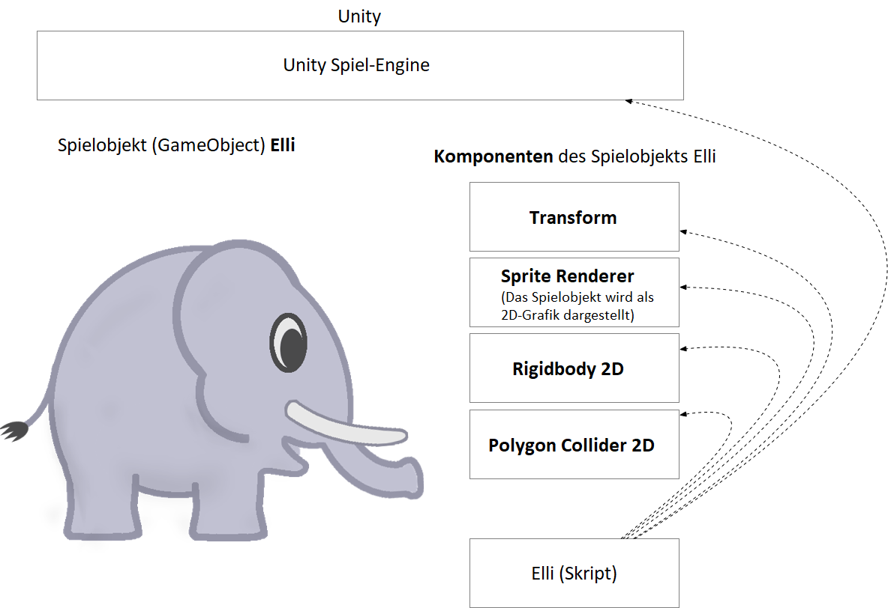
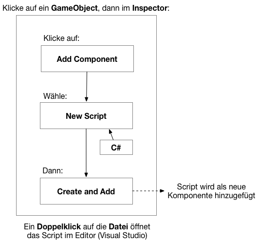

#Erste Schritte 

!!! Abstract "Lernziele"
    In diesem Kapitel lernst du, was ein Algorithmus ist. Du unterscheidest Spielobjekte und deren Komponenten in Unity. Du organisierst Projektdateien zu deinem Spiel. Und: Du schreibst dein erstes Programm in C*#*. 

---

##Was ist ein Algorithmus?

Informatikerinnen und Informatiker beschäftigen sich mit Algorithmen. Aber was ist das eigentlich - ein Algorithmus?

Programmieren könnte man als Problemlöseverfahren beschreiben. In unserem Fall ist das "Problem" etwa, dass wir ein Spiel erstellen wollen. Wir lösen es durch Einsatz von Unity und C*#*. Dabei kann man festhalten, dass nach einer bestimmten Zeit ein Resultat - also ein Spiel - entstehen sollte.

Ein bisschen allgemeiner könnte man daher sagen: 
**Ein Algorithmus ist ein Problemlöseverfahren in endlich vielen Schritten.**


!!! success "Übung"
	Schreibe *in Stichworten* einen Algorithmus für Zähne putzen.

---

##Erste Schritte in Unity

###Spielobjekte und Komponenten

In Unity besteht eine Szene aus einem oder mehreren Spielobjekt(en). Diese werden GameObject(s) genannt. Auch die Kamera, die eine Szene "filmt", ist ein GameObject. 

Spielobjekte können von unterschiedlicher Art sein. Die Art wird in einer [Klasse](../0270-classes/0270-classes.md) festgelegt. Die Eigenschaften eines Spielobjekts werden durch Komponenten (Components) bestimmt. Jedes Spielobjekt hat etwa die Komponente [Transform](../0180-transform/0180-transform.md), mit Hilfe derer die Position, die Rotation und die Größe (oder Skalierung) des Spielobjekts bestimmt werden kann.
Auch physikalische Eigenschaften werden einem Spielobjekt durch eine Komponente verliehen. Bei 2D-Spielen heißt diese Rigidbody2D. Ebenso werden Grenzen eines Spielobjekts (für Kollisionsabfragen) durch eine Komponente - Collider - angegeben.


C*#*-Skripte werden einem Spielobjekt über *"Add Component"* > *"New Script"* "angeheftet". 

Das besondere an Skripten ist, dass du darin auf andere Komponenten des Spielobjekts oder überhaupt auf andere Spielobjekte in einer Szene zugreifen kannst. Weiters können Eingaben durch Keyboard, Maus oder GamePad verwendet  oder andere Aspekte der Unity [Spiel-Engine](https://de.wikipedia.org/wiki/Spiel-Engine) verändert werden. Somit kannst du gezielt die Spiellogik für dein Spiel programmieren. 




!!! success "Übung"
	Beschreibe in eigenen Worten, wofür die Spielobjekt-Komponenten im obigen Bild verwendet werden. SpriteRenderer ist bereits beschrieben.

---

###Projektdateien

Projektdateien findest du in Unity unter *"Project"* > *"Assets"*. Mit *"Create"* kannst du dort neue Ordner und Dateien anlegen. Natürlich kannst du in Unity auch mit [Drag and Drop](https://de.wikipedia.org/wiki/Drag_and_Drop#/media/File:Drag-and-drop-de.svg) Dateien importieren.


Um sich Übersicht über die verwendeten Dateien zu verschaffen, können Ordner angelegt werden. 

!!!success "Arbeitsauftrag" 
    Lege folgende Ordner im "Assets"-Bereich von Unity an:

    * *Sprites*: für alle 2D Grafiken
    * *Scripts*: für alle C*#* Programm-Skripte
    * *Vorlagen*: für Spielobjekte, die als Vorlage erstellt und verwendet werden
    * *Material*: für physikalische Materialeigenschaften


!!!tip "Tipp"
    Du gelangst per Rechtsklick auf den *"Assets"*-Ordner zu einem Menü, in dem du ebenso *"Create"* findest.


Um ein neues Script für ein GameObject zu erstellen, mache folgendes:


!!!success "Arbeitsauftrag"
    Lege die Sprite-Datei [elef.png](../0900-img-all/elef.png) im Ordner *"Sprites"* in deinem Unity Projekt ab. Ziehe das neue Sprite anschließend vom Project Panel in das Hierarchy Panel. Nenne das neue GameObject "Elli". Hefte dem neu erzeugten GameObject Elli ein C#-Skript namens "HalloElli" an.
	
!!!tip "Tipp"
    Ein **Sprite** ist eine 2D Grafik. Das heißt, diese Grafik hat 2 Dimensionen. Sie kann auf der x- und der y-Achse positioniert und skaliert(=vergrößert und verkleinert) werden. Eine Tiefendimension (z-Achse), die man etwa bei 3D-Spielen verwendet, fehlt.


----

##Erste Schritte in C*#*

[C*#* (C Sharp)](https://de.wikipedia.org/wiki/C-Sharp) ist (in erster Linie) eine [objektorientierte](../0270-classes/0270-classes.md) Programmiersprache. Unity-Skripte kann man in C*#* (oder in [Javascript](https://de.wikipedia.org/wiki/JavaScript)) schreiben.

###Hallo Elli!

!!!success "Arbeitsauftrag"
    Öffne das C#-Skript "HalloElli.cs" in Visual Studio per Doppelklick auf diese Datei im Unity Projekt Panel. 

Bist du bereit für dein erstes C*#*-Skript? Kopiere nachfolgenden Programmcode nach "HalloElli.cs" und ersetze dessen Inhalte. 


``` c# 
using System;
using System.Collections;
using System.Collections.Generic;
using UnityEngine;

public class HalloElli : MonoBehaviour {
	
	int punkte = 1;
	string troeten = "Tröööt.";

	void OnDisable()
	{
		Debug.Log ("Hallo Elli!");
	}
}
```

!!!tip "Tipp"
    Du kannst die Tastenkombination `strg + c` (gleichzeitig drücken) zum Kopieren und `strg + v` zum Einfügen verwenden.

Zurück in Unity, drücke auf Start.


Anschließend, öffne das **Console Panel**. In diesem werden Rückmeldungen des Programms, wie etwa **Debug**-Nachrichten ausgegeben.


Nun, klicke das GameObject Elli an. Im Inspector findest du neben dem GameObject Namen eine Tick-Box. Klicke die Tick-Box an.


!!!success "Arbeitsauftrag"
    Notiere die Ausgabe in der Konsole.
   

###Programmstruktur in C*#*

Nachfolgend findest du die typische Programmstruktur eines C*#*-Skripts (mit Erklärungen): 

``` c#
//BIBLIOTHEKEN = PROGRAMMTEILE, DIE IN DAS SCRIPT IMPORTIERT WERDEN
using System; //using = EIN SCHLÜSSELWORT IN C#; using System HEIßT: verwende alle Klassen im Namespace(= Programmateil) System
using System.Collections;
using System.Collections.Generic;
using UnityEngine; //DIESE BIBLIOTHEK ERMÖGLICHT ETWA DEN ZUGRIFF AUF DIE UNITY SPIEL-ENGINE


//EINE KLASSE = class bezeichnung {... Inhalte der Klasse ...}
public class HalloElli : MonoBehaviour //DIESE KLASSE "ERBT" VON MonoBehaviour - IST ALSO FÜR EIN GAMEOBJECT 
{
	//KLASSEN-ATTRIBUTE (EIGENSCHAFTEN) WERDEN IN VARIABLEN GEFASST
	int punkte = 1;
	string troeten = "Tröööt.";

	//FUNKTION(EN) DER KLASSE
	void OnDisable()
	{
		//STATEMENT(S) - AUSDRÜCKE
		Debug.Log ("Hallo Elli!");

		/* Dies
		 * ist ein
		 * mehrzeiliges
		 * Kommentar
		 */

		//Dies ist ein einzeiliges Kommentar
	}
}
```

!!!bug "ACHTUNG"
    
	* Groß- und Kleinschreibung wird beachtet!
	* Alle Statements und Ausdrücke werden mit ```;``` beendet!
	* Jedes C*#*-Programm startet mit einer main-Funktion! (Diese wird von Unity im Hintergrund aufgerufen, wenn du dein Spiel startest.)

----

##Weiterführende Resourcen

* [Grundlagen der Sprache C*#* (aus dem Visual C*#* Handbuch)](http://openbook.rheinwerk-verlag.de/visual_csharp_2010/visual_csharp_2010_02_001.htm#mj44271ecc5b941bd18cde47caff03832a)

* [Introduction to Unity Tutorial Teil 1 (Ray Wenderlich, Englisch)](https://www.raywenderlich.com/772-introduction-to-unity-getting-started-part-1-2)

* [Introduction to Unity Tutorial Teil 2 (Ray Wenderlich, Englisch)](https://www.raywenderlich.com/770-introduction-to-unity-getting-started-part-2-2)
