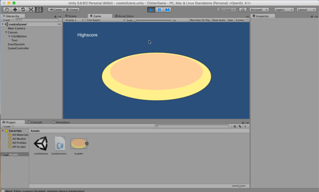

#Unity Transform Spielobjektkomponente

!!!abstract "Lernziele"
     Hier lernst du die wichtigste Spielobjekt-Komponente in Unity kennen: **Transform**.


Jedes Spielobjekt (GameObject) in Unity hat die Komponente **Transform** (oder **RectTransform** bei User Interface GameObjects).

----

##Eigenschaften von Transform

Mit **Transform** können

* die **Position** eines Spielobjekts, 
* **Drehungen** und 
* die Größe, oder **Skalierung**, 

eines Spielobjekts definiert werden.

Alle 3 Eigenschaften haben einen x-, y-, und z-Wert. 

In 2D-Spielen sind vor allem x-, und y-Werte wichtig.

* Bei **Position** stehen diese Werte jeweils für eine Koordinate im Koordinatensystem der **Szene**.

* Bei **Rotation** stehen die Werte für die Drehung des Spielobjekts um die X-Achse, die Y-Achse und die Z-Achse. Die Werte werden hierbei als Winkel *in Grad* angegeben. In 2D-Spielen kann vor allem eine Drehung um die Z-Achse effektiv eingesetzt werden.

* Bei **Scale** geht es um die relative Größe eines Spielobjekts. Standardmäßig ist hier der Wert 1 gesetzt. Werte sind hier als Veränderungs-Faktoren zum Standardwert zu verstehen.

Klarerweise können die Werte der Eigenschaften der Transform-Komponente in einem C*#*-Skript verändert werden.

----

##Krapfenklicker Erweiterung

Die Mehlspeise soll größer werden, wenn man darauf klickt! 

Wie kann man das programmieren?



Im GameController Spielobjekt des Krapfenklicker Spiels hast du bereits eine Variable angelegt, in der das Krapfen Spielobjekt gespeichert ist: ```public Button clickButton;```.

!!!bug "ACHTUNG"
    ```public``` bedeutet, dass diese Variable für andere Teile des eigenen Spiels (und damit in Unity) aufscheint und beschreibbar ist. Deshalb kannst du dem Skript in Unity ein Spielobjekt zuweisen. Siehe hierfür [GameObjects in Unity den Variablen vom Skript zuweisen](../0170-donutclicker/0170-donutclicker.md)!


----

###GetComponent(), Rechtecke und Vektoren 

Ok, wie kann man aber jetzt die Größe der Mehlspeise verändern?

Dafür benötigst du zuerst die aktuelle Größe der Mehlspeise. Diese bekommst du aus der Komponente **Transform**.
Die Komponente Transform (oder bei einem Button **RectTransform**) bekommst du mit:
``` c#
clickButton.GetComponent<RectTransform>()
```

!!!success "Übung"
    * Erkundige dich in der [Unity Scripting Referenz](https://docs.unity3d.com/ScriptReference/), wozu die Funktion ```GetComponent``` dient.
	* Was bedeuten [die Klammern ```<``` und ```>``` in C*#*](http://codekicker.de/fragen/csharp-bedeuten-spitzen-Klammern-generics-list-typ-typisierend/660)?

"Rect" steht für Rectangle, und das heißt: Rechteck. 

Bedienflächen wie Buttons werden in Unity in einem Rechteck in der Szene platziert. 

Ein Rechteck ([rect](https://docs.unity3d.com/ScriptReference/Rect.html)) hat in Unity folgende Eigenschaften: einen Startpunkt (als x- und y-Koordinate) und eine Größe (size), die als 2-dimensionaler *Vektor* angegeben wird - also auch mit einem x- und einem y-Wert für die Länge auf der X-Achse und auf der Y-Achse.	

!!!tip "Tipp"
    **Vektoren** sind Bewegungen in einem Koordinatensystem. Sie haben eine **Länge**, eine **Richtung** und eine **Orientierung**.

Da Vektoren in Unity für Größenänderungen, Positionsänderungen, Geschwindigkeit und anderes verwendet werden, gibt es eigene Referenz-Datentypen (oder [Klassen](..//0270-classes/0270-classes.md)) dafür: 

* ```Vector2``` (für 2D Vektoren) bzw. 
* ```Vector3``` (für 3D Vektoren).

Um die aktuelle Größe der Mehlspeise zu speichern, schreibst du daher:

``` C#
Vector2 meineGroesse = clickButton.GetComponent<RectTransform>().rect.size;
```

----

###Vektoren neu erstellen
 
Um die Mehlspeise bei jedem Button-Klick zu vergrößern, brauchst du als nächstes einen Wachstumsfaktor. Dieser gibt an, um wieviel die Mehlspeise je in die X-, und Y-Richtung wachsen soll.

Der Wachstumsfaktor wird in einen *neuen* 2D-Vektor gespeichert:

``` C#
Vector2 wachstumsFaktor = new Vector2 (10.0f, 10.0f); //In der runden Klammer werden dem neuen Vektor x-, und y-Werte des 2D Vektors als Paramter im Datentyp Float übergeben.
```

----

###Vektoren und Spielobjekt-Eigenschaften

Schließlich wird der Wachstumsfaktor zur aktuellen Mehlspeisgröße addiert. Du kannst den Größenunterschied in der Eigenschaft  [```sizeDelta```](https://docs.unity3d.com/ScriptReference/RectTransform-sizeDelta.html) des "ClickButton"s speichern:

``` C#
clickButton.GetComponent<RectTransform> ().sizeDelta = meineGroesse+wachstumsFaktor;
```

!!!success "Arbeitsauftrag"
    Ergänze die Funktion ```public void buttonclick()``` im Skript "GameController.cs" im Krapfenklicker Spiel, sodass die Mehlspeise bei jedem Buttonklick ein wenig größer wird.

!!!tip "Tipp"
    Wenn man ein Programm überarbeitet, wird dies häufig [**Refactoring**](https://de.wikipedia.org/wiki/Refactoring) genannt. **Refactoring** bedeutet die Verbesserung von Quellcode.
