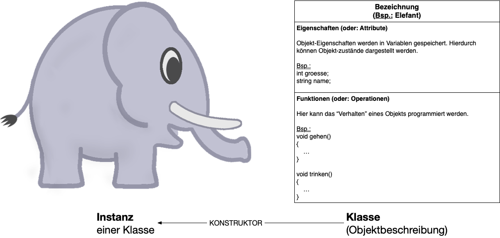

#Objekt-orientiertes Programmieren - Grundlagen

!!!abstract "Lernziele"
    In diesem Kapitel werden grundlegende Konzepte der Objekt-orientierten Programmierung, nämlich **Klasse**, **Instanz** und **Konstruktor** vorgestellt.

---


##Klasse und Instanz



Während eine Klasse ein Objekt mit **Eigenschaften** und **Funktionen** beschreibt, haben Eigenschaften der Instanz eines Objekts Werte. Ist eine Instanz zur Laufzeit eines Programms erzeugt worden, hat diese somit auch je einen bestimmten Zustand.

In C*#* kann eine Klasse folgendermaßen angegeben werden:
``` C#
    class Elefant : MonoBehavior
	{
	    ...
	}
``` 

###Der Konstruktor

Zum Erzeugen einer Instanz einer Klasse (also eines Objekts mit Werten aus einer Objektbeschreibung), wird die Konstruktor-Methode verwendet:

``` C#
    Elefant elli = new Elefant();
``` 


Das Schlüsselwort **new** gefolgt von der Konstruktor-Methode erzeugt eine neue Instanz einer Klasse. Die Instanz wird in eine Variable gespeichert. Der Datentyp der Variable ist die Klassenbezeichnung.

Innerhalb einer Klasse kann eine Konstruktor-Methode folgendermaßen definiert werden:
``` C#
    class Elefant : MonoBehavior
	{
		public Elefant() //Das ist die Konstruktor-Methode. Sie hat dieselbe Bezeichnung wie die Klasse.
		{
		    ... //Hier können der Instanz Werte bei der Erzeugung zugewiesen werden.
		}
	}
``` 

##BouncyFant - Intro

Nach dem Grundlagentutorial hast du genug Infos und Programmiererfahrung gesammelt, um das [BouncyFant Tutorial](http://example.com/ "BouncyFant Tutorial") zu beginnen. Natürlich kannst du jederzeit auf das Grundlagentutorial zurückgreifen, wenn du es brauchst.

Was wirst du im [BouncyFant Tutorial](http://example.com/ "BouncyFant Tutorial") lernen? 

* Mehr zu Objekt-orienterter Programmierung: Vererbung, Kapselung

und auch

* Dateimanagement in Unity
* Spielobjekt-Animation in Unity
* Spielobjektkomponente Rigidbody2d 
* Spielobjekte bewegen
* Springen mit Hilfe von Vektoren
* Kollisionsabfrage in Unity
* Spiellogik
