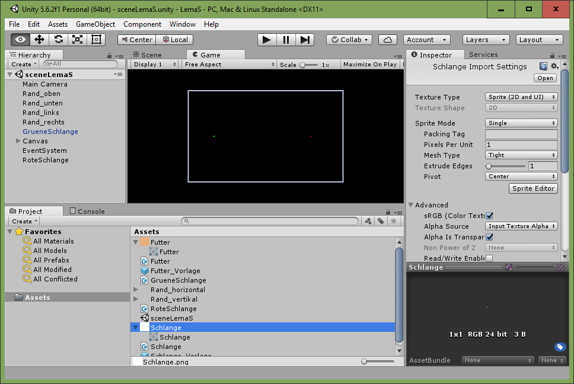
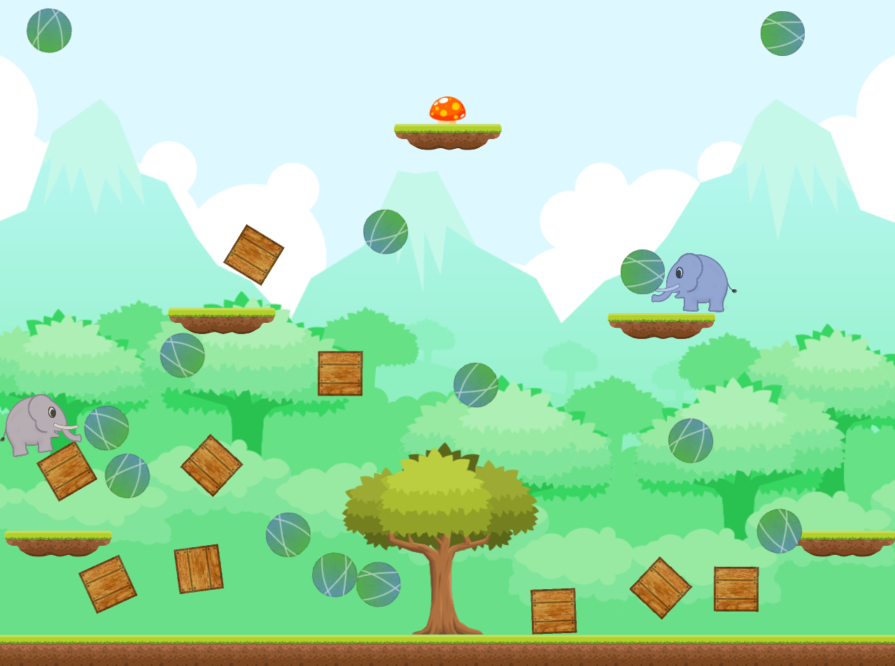

# Tutorial - Let’s make a Bouncy Fant Game!
## Einleitung
Hallo und herzlich willkommen beim learn to proGrAME-Tutorial.  
Hier lernst du, wie du dein erstes 2D-Spiel mit der Unity Engine entwickelst. Damit du einen einfachen und problemlosen Einstieg in das Thema hast werden wir das Spiel "BouncyFant" selber versuchen nachzuprogrammieren.

### Warum verwenden wir die Unity Engine?
Wir verwenden die Unity Engine, weil sie viele Features von Haus aus eingebaut hat die wir für die Erstellung eines Spiels brauchen. Somit können wir uns mehr auf das Design von unserem Spiel und die grundlegende Programmierung konzentrieren. Unity hat zum Beispiel bereits eine richtig coole Physik Engine eingebaut, mit der wir lustige Effekte in unserem Spiel erschaffen können.

Die Unity Engine wird auch von professionellen Spielentwicklern verwendet. So wurden zum Beispiel das Online Kartenspiel „Hearthstone“ von Blizzard, oder das beliebte Handygame „Temple Run“ mit Unity erstellt.  

### Über das Tutorial
In diesem Tutorial wirst du dich mit Unity und einigen Abschnitten Programmcode vertraut machen. Nach dem Absolvieren des Tutorials wird dir mehr Freiraum gegeben eigenständig zu entwickeln.

!!!Tip "Tipp"
    Wenn du dir nicht sicher bist, ob du ein Wort richtig verstehst, schau bitte zuerst im Glossar selbst nach. Unsere Videos auf dem Youtube Kanal helfen dir bei schwierigen Abschnitten. Sollte etwas schief laufen, kannst du natürlich nachfragen. Für Notfälle ist nach jedem Kapitel auch ein Link zu einer Projekt-Datei mit dem jeweiligen Fortschritt vorhanden.

## Grundlegende Infos
Zum Programmieren benötigt man Entwicklungswerkzeuge, wie einen [Compiler](https://de.wikipedia.org/wiki/Compiler), einen [Assembler](https://de.wikipedia.org/wiki/Assembler_(Informatik)) oder einen [Interpreter](https://de.wikipedia.org/wiki/Interpreter). Wichtig ist ein Editor, mit dem man den Quellcode schreibt (z.B. Notepad++, TextWrangler, Sublime, Geany, ...). Diese Entwicklungswerkzeuge können getrennt voneinander oder in einem Gesamtpaket eingesetzt werden. Wird ein Gesamtpaket verwendet, spricht man von einer integrierten Entwicklungsumgebung (auf Englisch: “Integrated Development Environment”  oder kurz: IDE).
Wir verwenden in diesem Tutorial [Unity 5.6.2](https://unity3d.com/de/get-unity/download/archive). Genaugenommen sind das sogar zwei IDEs, die zu einem Paket zusammengeschnürt wurden: Die Unity-IDE und Visual Studio Community Edition. Für dieses Tutorial solltet ihr daher Unity und Visual Studio installiert haben. Wir verwenden die englische Version von Unity damit alles was du hier lernst auch in Zukunft noch Wert hat, außerdem gibt es für die Version im Internet auch mehr Tutorials. Solltest du eine andere Version installierst haben, keine Sorge, alles was du hier tust geht vermutlich auch in deiner Version, aber vielleicht schauen ein paar Dinge anders aus.

Abbildung: Unity IDE mit einem Snake-Spiel

Abbildung: Microsoft Visual Studio Community Edition

## Das Spiel
### Die Hintergrundstory
#### Bouncy Fant - Der Anfang
Der verrückte Dr. Clamberwoods hat ein Netzwerk aus Maschinen entworfen, mit dem er die Gesetze der Physik kontrollieren und verändern kann. Diese Maschinen konnte er jedoch nur an einem Ort installieren, an dem sie unentdeckt blieben und der von anderen Menschen weit, weit entfernt war. Jener Ort war ein unbekanntes Stück Regenwald in Zentralafrika und die Heimat der höchst seltenen, aber intelligenten Miniatur-Elefanten,  die sich selbst, wegen ihres elastischen Körperbaus und ihrer Fähigkeit sehr hoch springen zu können, Bouncy Fants nennen.
Dr. Clamberwoods’ finsterer Plan ist es, mit Hilfe seiner Maschinen sämtliche Bäume zu entwurzeln und dem Waldboden seine Bodenschätze zu entreißen. Nur mit den Diamanten und Edelmetallen, die er aus dem Regenwaldboden mit seinen Maschinen extrahiert, kann er die enormen Ressourcen aufbringen, um ein noch mächtigeres Geflecht aus Maschinen zu bauen, das letztendlich die physikalischen Gesetze auf dem ganzen Planeten durcheinander bringen und ihm zur Herrschaft über die Welt verhelfen soll.
Die Tiere des Waldes sind verzweifelt und befürchten, dass sie alle sterben müssen. Doch zwei junge Bouncy Fants wollen die Hoffnung nicht aufgeben. Die Elefanten Elli und Ossi machen sich auf den Weg, um Dr. Clamberwoods zu stoppen und den Regenwald und die ganze Welt zu retten.
Die zwei Elefanten müssen auf ihren Abenteuern magische Gegenstände finden, hilfsbereite Tiere befragen und Teile des tödlichen Geflechts von Dr. Clamberwoods Maschinen zerstören.

#### Das Spielprinzip
Im Spiel geht es geht darum, einen Elefanten möglichst schnell durch eine Welt, in der übertriebene und unglaubliche physikalische Gesetze gelten, zu steuern. Während unterschiedliche Gegenstände von oben auf die Bouncy Fants herabprasseln, müsst ihr versuchen einen seltenen Gegenstand (z.B. einen magischen Pilz) zu erreichen. Wer zuerst den magischen Pilz erreicht, hat gewonnen.

Abbildung: Unser Spiel: Bouncy Fant

# Optional: Erstelle eine eigene Spielfigur
Du kannst mit Gimp, der gratis verfügbaren Alternative zu Photoshop, gute Grafiken für dein Projekt erstellen. Du kannst dieses Tutorial auch mit dem vorgegebenen Elefanten durcharbeiten oder dir jetzt einen eigene Spielfigur zeichnen.

Mehr zum Erstellen einer Spielfigur findest du in unserem [GIMP-Tutorial](/0210-drawingingimp/0210-drawingingimp) oder auf unserem Youtube-Channel: [learn to proGrAME Tutorial Videos](https://www.youtube.com/watch?v=C1rcqXZEk7M&list=PLwrS_Vh1B1U0EijF95WOlp0L5qMTJ-1QS).
