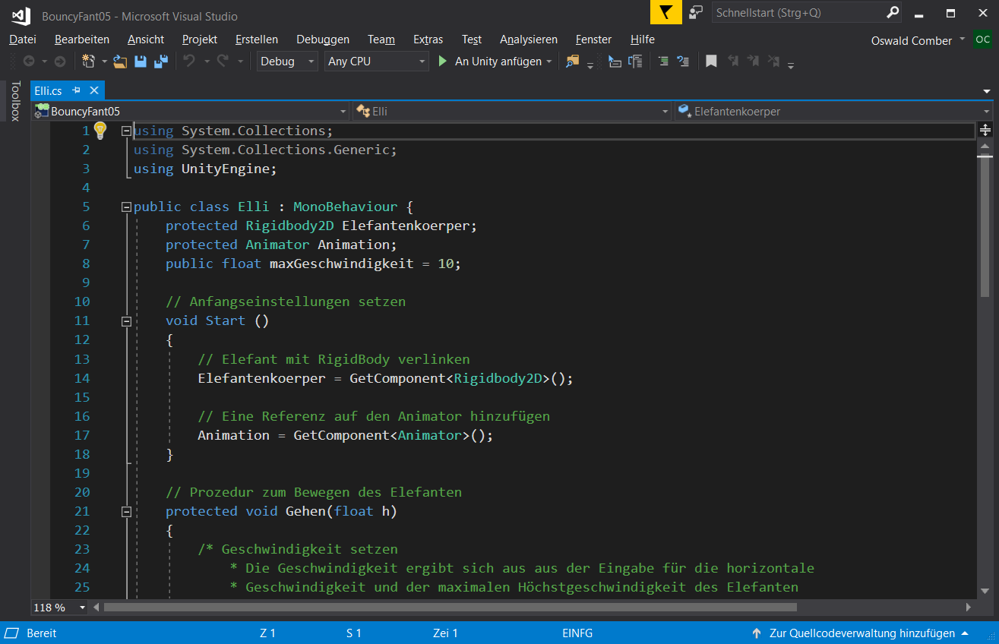

# Tutorial - Let’s make a Bouncy Fant Game!
## Einleitung 
Hallo und herzlich willkommen beim learn to proGrAME-Tutorial.  
Hier lernst du, wie du dein erstes 2D-Spiel mit der Unity Engine entwickelst. Damit du einen einfachen und problemlosen Einstieg in das Thema hast werden wir das Spiel "BouncyFant" selber versuchen nachzuprogrammieren.
 
### Warum verwenden wir die Unity Engine? 
Wir verwenden die Unity Engine, weil sie viele Features von Haus aus eingebaut hat die wir für die Erstellung eines Spiels brauchen. Somit können wir uns mehr auf das Design von unserem Spiel und die grundlegende Programmierung konzentrieren. Unity hat zum Beispiel bereits eine richtig coole Physik Engine eingebaut hat mit der wir lustige Effekte in unserem Spiel erschaffen können. 
 
Die Unity Engine wird auch von professionellen Spielentwicklern verwendet. So wurden zum Beispiel das Online Kartenspiel „Hearthstone“ von Blizzard, oder das beliebte Handygame „Temple Run“ mit Unity erstellt.  
 
Über das Tutorial 
In diesem Tutorial wirst du dich mit Unity und einigen Abschnitten Programmcode vertraut machen. Nach dem Absolvieren des Tutorials wird dir mehr Freiraum gegeben, eigenständig zu entwickeln.

!!! Tip "Tipp" Wenn du dir nicht sicher bist, ob du ein Wort richtig verstehst, schau bitte zuerst im Glossar selbst nach. Unsere Videos auf dem Youtube Kanal helfen dir bei schwierigen Abschnitten. Sollte etwas schief laufen, kannst du natürlich nachfragen. Für Notfälle ist nach jedem Kapitel auch ein Link zu einer Projekt-Datei mit dem jeweiligen Fortschritt vorhanden. 

## Grundlegende Infos
Zum Programmieren benötigt man Entwicklungswerkzeuge, wie einen Compiler, einen Assembler oder einen Interpreter. Wichtig ist ein Editor, mit dem man den Quellcode schreibt (z.B. Notepad++, TextWrangler, Sublime, Geany, ...). Diese Entwicklungswerkzeuge können getrennt voneinander oder in einem Gesamtpaket eingesetzt werden. Wird ein Gesamtpaket verwendet, spricht man von einer integrierten Entwicklungsumgebung (auf Englisch: “Integrated Development Environment”  oder kurz: IDE). 
Wir verwenden in diesem Tutorial Unity 5.6.2. Genaugenommen sind das sogar zwei IDEs, die zu einem Paket zusammengeschnürt wurden: Die Unity-IDE und Visual Studio Community Edition. Für dieses Tutorial solltet ihr daher Unity und Visual Studio installiert haben. Wir verwenden die englische Version (für die gibt es im www auch mehr Tutorials).

Abbildung: Unity IDE mit einem Snake-Spiel

Abbildung: Microsoft Visual Studio Community Edition 