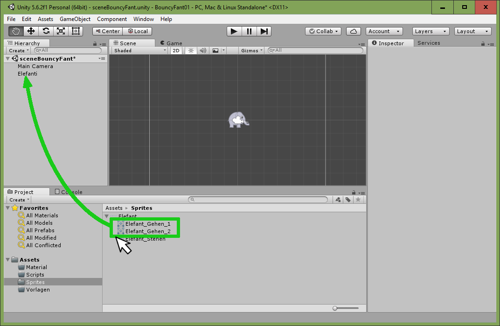
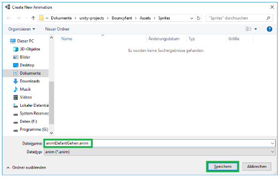
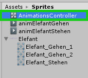
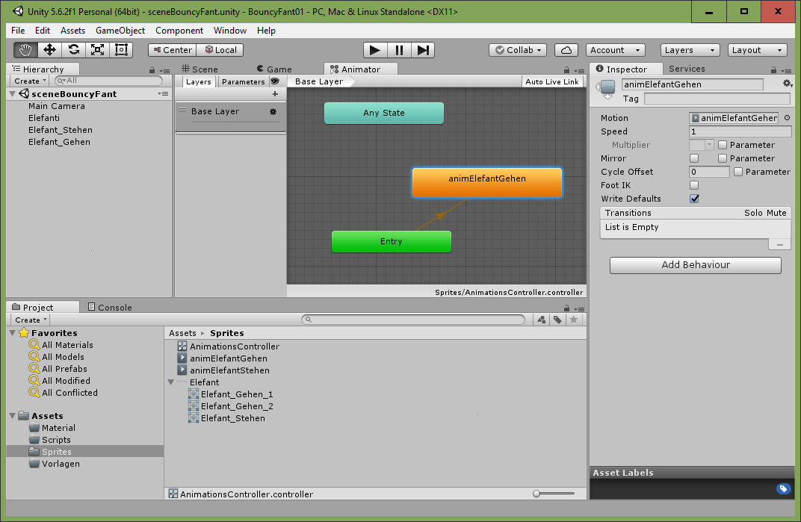
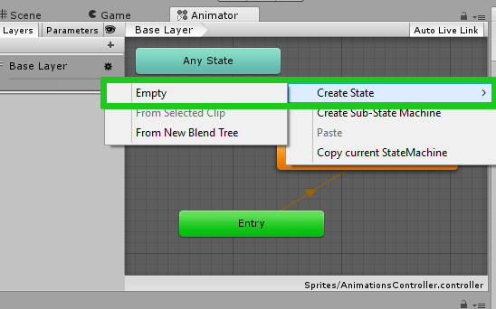
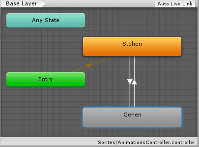
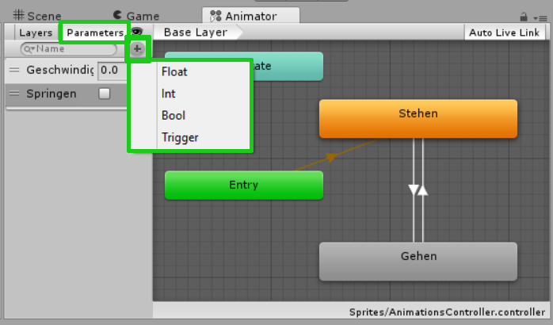
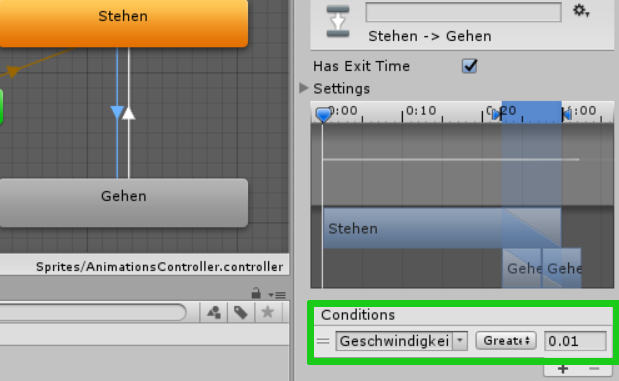
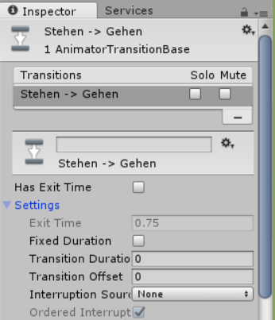

# Teil 2 - Animationen und "States"


In diesem Kapitel wirst du... |  Geschafft?
------------------------------|-------------
Benennung der Animationsstufen überprüfen |  
Eine Animation erstellen. |
Dem AnimationsController einen geeigneten Namen geben. |
Einen State im AnimationsController erstellen. |
Übergänge zwischen Animationen einstellen |
Variablen im AnimationsContoller erstellen |
Bedingungen für die Übergänge einstellen |

Überprüfe, ob du, wie in [Teil 1](0280-bouncyfant/T01-adassets/) vorgegeben, den Animationsstufen die Namen **Elefant_Gehen_1**, **Elefant_Gehen_2** und **Elefant_Stehen** gegeben hast. Klicke auf dein Elefant Asset, sieh im Sprite Editor nach und benenne gegebenfalls die Animationsstufen. Wenn du im Sprite Editor die einzelnen Bilder anklickst, erscheint um den betreffenden Spriteteil ein blauer Rahmen. Im rechten Eck erscheint ein Fenster, wo oben der Name der Animationsstufe eingetragen sein soll.

## States und Animationen

Bevor wir den Elefanten am Bildschirm hin- und herbewegen wollen, legen wir zuerst die Bewegungsabläufe oder Animationen (Stehen und Gehen) für den Elefanten fest. Die Bewegungsabläufe sind durch unterschiedliche Zustände (engl. *states*)  gekennzeichnet.  Ein Zustand der Spielfigur ist “Stehen” und der andere Zustand ist “Gehen”. Solange später der Elefant mit Tasteneingaben (das kommt später) bewegt wird, befindet sich das GameObject Elefant im Zustand Gehen, und dann bewegen sich seine Beine.

### Animationen

Animationen werden erstellt, indem man das Sprite aufklappt (siehe Screenshot[^1]), dann die gewünschten Animationsstufen auswählt und vom Projekt-Bereich auf ein Objekt im *Hierarchy*-Bereich zieht. Das Erstellen von Animationen funktioniert, wenn man mehrere Animationsstufen in das Hierarchy Panel zieht, in unserem Fall *Elefant_Gehen_1* und *Elefant_Gehen_2*, automatisch.

Du speicherst die neue Animation im Ordner *Sprites* und gibst ihr einen sinnvollen Namen (z.B. *animElefantGehen.anim*).


<!-- korrektes Bild? bezeichnungen ev verwirrend -->

[^1]: Anm: Wenn der Listenbereich bei euch anders aussieht dann findet ihr in Kapitel Arbeitsbereich kennenlernen und konfigurieren unter der Überschrift Listenansicht im Asset Panel den Hinweis, wie man die Ansicht umstellt



Durch das Erstellen der Animation per Drag & Drop wird automatisch ein Animations-Controller erstellt. Gib diesem einen sinnvollen Namen wie z.B. Elefant_AnimationsController  

<!-- korrektes Bild? leicht anderes in google docs -->

Zusätzlich muss noch eine Animation für den Zustand “Stehen” erzeugt werden. Dies geschieht mittels Rechtsklick auf “Elefant_Stehen” **-> Create -> Animation**.

### Animator

Wenn man diesen Controller doppelt klickt öffnet sich der *Animator (Window/Animator)*. Im Animator sind verschiedene Zustände (*States*) und deren Übergänge definiert.



Neue *States* kann ich mittels Rechtsklick und dann durch Klicken auf *Create States -> Empty* hinzufügen (siehe Screenshot unten).

  
Zuerst wollen wir einen Zustand namens Stehen erzeugen. Diesem müssen wir die *Stehen*-Animation zuweisen.  
Dann setzen wir diesen Zustand als Standard (Klick mit der rechten Maustaste auf einen State -> “Set As Layer Default State”). Dadurch wird der Zustand orange gekennzeichnet. Unsere Animation startet immer beim Default State.
Mittels Rechtsklick auf den Zustand und Make Transition fügt man neue Übergänge zwischen den Zuständen hinzu.


Ziel ist es, dass die Geh-Animation (die in dem entsprechenden Zustand ausgewählt ist) aktiv ist, wenn der Elefant bewegt wird! Am Ende wollen wir die Zustände und Übergänge so wie am Screenshot unten verbunden zu haben.



Man nennt verbundene Zustände eine State Machine oder einen Zustandsautomat. Man kann sich diesen tatsächlich wie eine abgeschlossene Maschine vorstellen.

### Parameter
 Um der State Machine mitzuteilen, in welcher Animationsstufe sich unsere Spielfigur gerade befindet, benötigen wir Parameter. Neue Parameter stellt man im Animator ein, indem man auf Parameters klickt und dann das Plus-Zeichen anklickt. Wir erstellen die Parameter Geschwindigkeit vom Typ Float (Kommazahl) und Springen vom Typ Bool (```true``` \ ```false```). Da der Animator und die Code-Datei (Script) im Inspector zugewiesen sind, können Parameter später im Code verwendet werden.



Wenn man nun auf Play drückt, wechselt der Elefant von selbst alle paar Sekunden von der stehenden Animation in die Animation des Gehens. Auch wenn sich der Elefant gar nicht hin- und her bewegt, zappelt er mit den Beinen. Das ist aber etwas komisch für den Spieler, wenn eine Figur die Beine bewegt ohne eigentlich zu gehen.Damit sich unsere Spielfigur später im Spielen nur dann die Beine bewegt, wenn wir auch den Elefanten hin und her bewegen, müssen wir den Übergang von von Stehen zu Gehen und von Gehen zu Stehen an eine Bedingung knüpfen: Ist die horizontale Geschwindigkeit kleiner als 0.01, so soll der Elefant stehen. Ist die horizontale Geschwindigkeit jedoch größer als 0.01, so soll die Animation für die Bewegung abgespielt werden. Diese Bedingungen legt man unter *Conditions* fest. Dafür klickt man einfach den Übergang (blauer Pfeil im Screenshot) an und fügt mit dem “+” eine neue Bedingung hinzu.

!!!Tip "Tipp"
    Im Englischen (und somit auch Unity) wird statt eines Kommas ein Punkt für Dezimalzahlen verwendet. Wenn man in Unity einen Beistrich als Trennzeichen für Dezimalzahlen verwendet, macht das Programm automatisch einen Punkt daraus. ACHTUNG! Beim Programmieren in C# funktioniert das allerdings nicht und man muss einen Punkt verwenden.

 Um nochmal zu erläutern: Wenn es eine Bewegung gibt, also eine Geschwindigkeit über 0.01, ändern wir auf die Gehen Animation, aber sobald die Bewegung endet und die Geschwindigkeit wieder unter 0.01 ist, ändern wir zurück auf die Stehen Animation.

Bedingung für den Übergang von Stehen zu Gehen:



### Einstellungen bei den Übergängen

Bei beiden Übergängen müssen wir noch ein paar Einstellungen treffen, damit die Bewegung nicht verzögert auftritt. *Has Exit Time* soll nicht ausgewählt sein, *Fixed Duration* ebenso nicht, die *Transition Duration* und das *Transition Offset* sollten auf 0 gesetzt werden. Diese Optionen würden bewirken, dass die Übergangsbedingung an eine Zeitdauer (Duration) geknüpft ist (Fixed Duration) oder der Übergang verzögert oder mit einer gewissen Geschwindigkeit erfolgt (Transition Offset/Duration). Hier soll aber der Elefant sofort aufhören, die Beine zu bewegen, wenn er stehen bleibt.




#### Sourcecode
Download Sourcecode Teil 02: [http://comber.at/dev/BouncyFant02.zip](http://comber.at/dev/BouncyFant02.zip)
