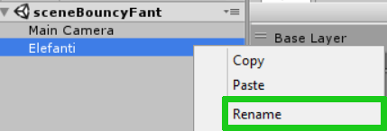
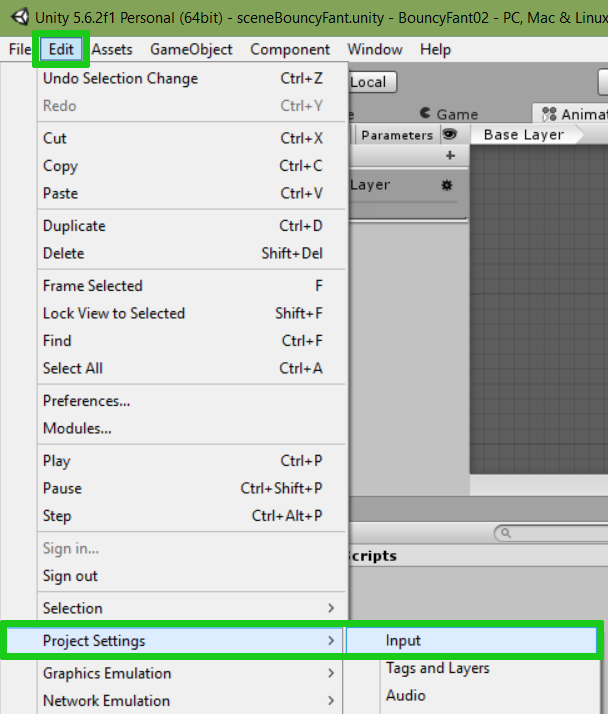
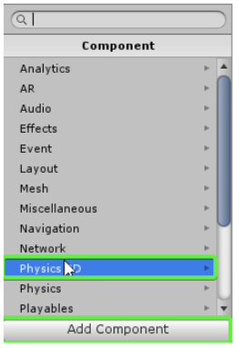
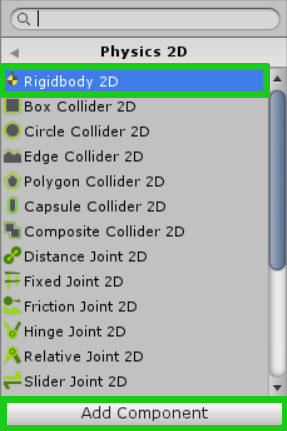
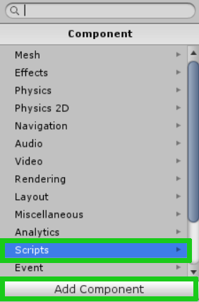
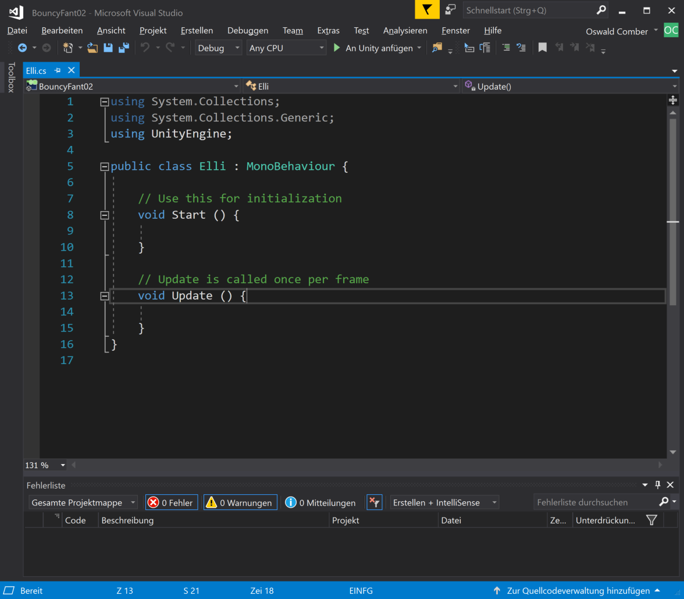
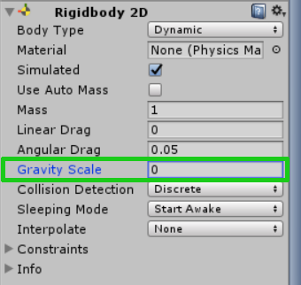

# Teil 3 - Bewegung


In diesem Kapitel wirst du...  |    Erledigt?
-------------------------------|----------------
Die Steuerung deiner Figur einstellen. |
Die RigidBody 2D Komponente zu deiner Figur hinzufügen. |
Ein Script schreiben, dass es deiner Figur erlaubt sich zu bewegen. |
Das Script zu deiner Spielfigur hinzufügen. |

### Die Bewegung der Elefantin implementieren

Bevor wir mit der Realisierung der Bewegung starten, benennen wir unsere Spielfigur einmal um, damit wir uns später, wenn wir mehrere Figuren haben, besser orientieren können. Ich habe den Namen Elli gewählt. Einfach mit rechten Maustaste draufklicken und auf Rename klicken. Alternativ kannst du auch den Namen anklicken und F2 drücken.


<!-- elefanti verwirrender name? -->

Zuerst kümmern wir uns um die Tasten-Eingabe für die Bewegung. Unter *Edit -> Project Settings -> Input* kann man den *Input Manager* aufrufen.



Im Input Manager siehst du eine Horizontal Achse und eine Vertikal Achse. Diese benennen wir im ersten Schritt mal um. Ich habe sie hier mit **“H-AchseElli”**  bzw. **“V-AchseElli”** benannt. Diesen Namen brauchen wir später noch beim Programmieren. Bei den Achsen steht jeweils Positive Button und Negative Button mit je einem Feld wo man eine Taste eintragen kann.

Dieser Positive/Negative Button macht Sinn wenn du dir ein Koordinatensystem vorstellst. In so einem System ist auf der Horizontal Achse, Positiv nach Rechts, und Negativ nach Links bzw. auf der Vertikalachse, Positiv nach Oben und Negativ nach Unten. Wenn jemand die Taste drückt die bei der HorizontalAchse Positiv Button ist, bewegt sich die Figur nach Rechts.

Du kannst also jetzt die Tasten für die jeweiligen Bewegungsrichtungen eintragen, so wie du denkst die Steuerung ist am Besten. Ein Beispiel hierfür wäre:

- H-AchseElli
    - Negative Button: a
    - Positiv Button: d
    - Type: Key or Mouse Button
- V-AchseElli
    - Negative Button: s
    - Positiv Button: w
    - Type: Key or Mouse Button

!!!bug "WICHTIG"
    Stelle sicher, dass unter Type “Key or Mouse Button” ausgewählt ist, ansonsten funktionieren unsere Einstellungen nicht richtig.


Da wir gerade die Projekteinstellungen geändert haben, ist es wichtig nun auch das Projekt zu speichern. Das geschieht durch das Anklicken von *File* und *Save Project*.


### Rigidbody2D

Da Elli kein unbewegliches Objekt in unserem Spiel sein wird, brauchen wir eine Komponente, die uns hilft Elli zu bewegen, die Bewegungen zu berechnen und sogar die Physik auf sie wirken zu lassen. Glücklicherweise bietet Unity genau so eine Komponente an, die sich um all die Dinge, wie Bewegung, Berechnung physikalischer Vorgänge und Eigenschaften, Kollisionen, elastische Stöße und dergleichen kümmert. Diese Komponente nennt sich Rigidbody2D. Rigid bedeutet so viel wie “starr”, und dass der Körper starr ist, kommt uns sehr gelegen, denn wir brauchen uns nicht darum kümmern, eine ganze Skellettstruktur für Elli zu modellieren.  Einen Rigidbody2D erstellen wir, indem wir im Hierarchy Panel auf Elli draufklicken und dann im Inspector Panel auf der rechten Seite auf *Add Component -> Physics2D -> Rigidbody 2D* klicken.


<!--  -->
<!-- noch zu formatieren -->


Um die Bewegung zu programmieren, benötigen wir ein Script, das der Spielfigur Elli hinzugefügt wird. Dieses Script erstellen wir, indem wir im *Hierarchy Panel* auf Elli klicken und dann im Inspector Panel auf der rechten Seite auf A*dd Component -> NewScript -> Create and Add* (siehe Screenshot) klicken.


<!--  -->
<!-- noch zu formatieren -->


Das eben erstellte Script befindet sich nun im Projekt im Asset Panel. Wir verschieben es jedoch in das Unterverzeichnis Scripts.

Durch einen Doppelklick auf das Script öffnet sich Visual Studio und wir können nun mit dem Programmieren beginnen.


#### Wiederholung der C# Grundlagen

**Kommentar**:

In C-Sprachen sind Zeilen, die mit ```//``` beginnen, Kommentare. Das sind Texte, die vom Compiler ignoriert werden, also nur für den Programmierer sichtbar sind. Diese Zeilen erklären das Programm für später oder andere Programmierer. KOmmentare werden grün angezeigt.

**Variablen**:

Eine Variable kann wie in der Mathematik einfach Zahlen enthalten. Allerdings gibt es nicht nur *Datentypen* für Zahlen, sondern auch Text. Der Datentyp einer Variable wird in C-Sprachen immer vor dem Namen einer neuen Variable angegeben.
``` c#
	String name = “Jenny”;
	integer alter = 12;
	alter = alter + 1;
```
Diese beiden Variablen “name” und “alter” werden gleich bei der *Deklaration* (Das erste mal definieren) mit Werten belegt durch ```=```. Den Wert kann man später auch ändern.. Am Ende dieser Codestelle enthält die Variable “alter” den Wert 13.

**Funktionen**:

Sie beinhalten Algorithmen, also Problemlöseverfahren mit endlich vielen Schritten.
<!-- Definition von Algorithmus VB -->
Eine Funktion ist deshalb nützlich, weil ein spezielle Berechnung nicht öfters programmiert werden muss, sondern öfters abrufbar ist. Gibt es Daten, die von der Funktion verarbeitet werden müssen (=*Parameter*), werden diese beim Funktionsaufruf in runden Klammern mitgeteilt. Wird im aufrufenden Codestück ein Ergebniswert benötigt, muss die Funktion mit dem Keyword *return* ein Ergebnis zurückliefern! Der Datentyp, der von return geliefert werden muss, steht vor dem Funktionsnamen ( bei der Funktion *integer addieren()*{... return a;} ist der return-Datentyp *integer*!). Liefert eine Funktion nichts zurück, nennt man sie Prozedur. Es entfällt das Keyword “return” am Ende der Prozedur. Als return-Datentyp wird “void” (engl. “nichts”) angegeben. Beispiel:

``` c#
double a = 1.5;	//"double" ist der gängige Datentyp für Kommazahlen
double b = 4.3;	//a und b werden unten als Parameter für die Funktion verwendet
integer c = 0;	//integer kann nur ganze Zahlen speichern. Speichert man darin eine Kommazahl, wird nicht gerundet, sondern die Kommastellen werden einfach gelöscht!
integer addieren_int(double  a, double b) {
	return a + b; //das Zwischenergebnis ist hier 1.5 + 4.3 = 5.8
}
c = addieren_int(a,b);
```

Diese Funktion “addieren_int” addiert zwei Kommazahlen (double) und gibt eine Integer-Zahl (Zahl ohne Kommastellen) zurück. In der Variable “c” ist nachher “5” gespeichert.

**Class**: Klassen sind vom Programmierer und Programmierinnen erstellte Datentypen. Diese enthalten Eigenschaften in Form von Variablen und Algorithmen in Form von Funktionen (etwa eine Funktion, die das Alter erhöht). Zu einer Klasse zugehörige Funktionen nennt man auch *Methoden*. Die Variablen einer Klasse werden auch Member(-variablen) genannt, da sie ohne einem Objekt nicht existieren.
Etwa definiert die Klasse “Katze” die Eigenschaften Farbe, Alter und die Methode gehen(), miauen(), etc. Das Objekt Schnurli ist weiß, 2 Jahre alt und kann gehen und miauen.
Das könnte in C# so programmiert sein:

``` c#
public class Elefant {
	public String farbe;
	public int alter;
	Elefant() { } //Die Methode mit dem selben Namen wie die Klasse nennt man Konstruktor. Er wird hier aber nicht verwendet. Man könnte damit die Variablen oben belegen lassen!
	gehen() { }  //nicht ausprogrammiert
	troeten(int anzahl) {
		while(anzahl > 0) {
			Console.WriteLine("Töröööö! "); //In einem Textfenster wird
								"Töröööö!" ausgegeben
			anzahl--; //der Parameter Anzahl wird reduziert um 1
		}
	}
}
Katze benjamin = new Elefant(); //Dieser Konstruktor erfordert keine Variablen
benjamin.farbe = "grau";
benjamin.alter = 30;
benjamin.troeten(2);
```
*Ausgabe in Konsole: “Töröööö! Töröööö! ”.*

**Zugriff und Punktoperator**: wie im Beispiel oben ersichtlich ist, kann mittels diesem **.** auf eine Variable eines Objektes zugegriffen werden wie bei
``` c#
benjamin.farbe = "grau";
```
Variablen von Objekten können nur dann mit **.** gelesen und geschrieben werden, wenn der zugriff darauf bei der *Deklaration* mit dem keyword *public* erlaubt wurde. Wie hier:
``` c#
public String farbe;
```

**Instanz**: oder Objekt wird aufgrund der Vorgaben der zugehörigen Klasse erzeugt. Das Objekt enthält die von der Klasse definierten Variablen und kann diese befüllen.
**Vererbung**: ist das wichtigste Konzept bei der Verwendung von Klassen oder Objekten (Objektorientierung). Im Code steht etwa:
public class Elli : MonoBehaviour { …
Das bedeutet, dass die neue, hier definierte, Klasse Elli (meist alle) Variablen und Methoden von Monobehaviour erbt, diese also auch Elli zur Verfügung stehen. MonoBehaviour ist eine zentrale von Unity schon vorgegebene Klasse, die u.a. Zugriff auf viele Komponenten zulässt, wie RigidBody, das wir einen Abschnitt weiter oben schon bei der Spielfigur hinzugefügt haben.

#### Codebibliotheken

``` c#
using System.Collections;
using System.Collections.Generic;
using UnityEngine;
```

Das Keyword *using* importiert jeweils vorhandene Codebibliotheken (Sammlungen an Sachen die jemand anderer bereits programmiert hat und wir verwenden können) auf die im Script dadurch zugegriffen werden kann. Etwa wird die UnityEngine Bibliothek importiert, die das *MonoBehaviour* zur Verfügung stellt. In Unity müssen alle C#-Codedateien eine Klasse, die von Monobehaviour erbt, beinhalten. Dadurch werden u.a. die Funktionen Update() oder FixedUpdate() verfügbar, die später erklärt werden.

<!--
Erklärung von häufigen Codeelementen
man könnte noch erklärungen anführen zu
public/private:
If , Bedinungssyntax:
funktion/prozedur: aufruf und return
datentypen?
schleifen?
-->

!!!bug "Achtung"
    Beachte bitte, dass der Name der Klasse (Elli) jedenfalls mit dem Namen der Code-Datei (Script) übereinstimmen muss. Du hast die Code-Datei wahrscheinlich nicht *Elli* genannt und musst in folgender Zeile Elli mit diesem Dateinamen ersetzen:
``` c#
public class Elli : MonoBehaviour {
```

Das Ergebnis ist dann:
``` c#
public class [MeinScriptName]: MonoBehaviour {
```



Am Anfang nehmen wir in unserem Script ein paar kleine Änderungen vor. In der Kommentarzeile ersetzen wir die englische Anmerkung durch die Zeile ```// Anfangseinstellungen setzen```  und die Prozedur ```Update``` benennen wir in ```FixedUpdate``` um. ```FixedUpdate``` sorgt nämlich dafür, dass das Spiel auf unterschiedlich schnellen Geräten (egal ob auf einem älteren Notebook, einem Smartphone, oder einem brandneuen Gaming PC) immer gleich schnell läuft. Schnell meint in diesem Fall **nicht** die Framerate (FPS), sondern wie schnell sich die Spielfigur und die Objekte im Spiel bewegen. Obwohl sich nun die Spielfigur auf allen Plattformen gleich schnell am Bildschirm herum bewegt, hat man auf dem neuen Gaming-Monster-PC eine höhere Framerate als auf einem uralten Notebook.

``` c#
// Anfangseinstellungen setzen
void Start ()
{

}

// Fixed Update wird immer in einem fixen Intervall aufgerufen.
void FixedUpdate()
{

}
```

Der nachfolgende Quellcode, um die Bewegung von Elli zu realisieren, ist ein wenig komplizierter. Deshalb betrachten wir das Einbauen der Prozedur Gehen nun als Übung im Umgang mit dem Quellcode. Im Prinzip machen wir in der Prozedur ```Gehen``` folgendes:
Wir berechnen aus dem Wert, den wir aus der horizontalen Eingabe-Achse abfragen, die horizontale (seitliche) Bewegung des Elefantenkörpers.
Wir bestimmen anhand der Bewegung des Elefantenkörpers die Blickrichtung.
Wir übermitteln die Bewegungsgeschwindigkeit an die Animation in Unity.
Dabei kümmert sich Unity um einige Dinge, um die wir uns nun nicht mehr kümmern brauchen:
Unity übernimmt die Abfrage der Tasten-Eingabe des Spielers für uns.
Unity kümmert sich ebenso um die Bewegung des Elefantenkörpers.
Wir müssen lediglich die aktuelle Geschwindigkeit von Elli unserer Animation übermitteln.

Den nachfolgenden Quellcode fügen wir zwischen der geschwungenen Klammer { am Ende der Prozedur Start und den Kommentar vor FixedUpdate hinein.

!!!Tip "Tipp"
    Bei Interesse wird der Code in den Kommentaren genauer erklärt.

``` c#
// Prozedur zum Bewegen des Elefanten
// Der Parameter h ist 1 oder -1, wenn der Spieler die Taste für nach links oder rechts drückt. Sonst 0.
//Bei Steuerung des Elefanten mit Maus müsste man von h den Absolutbetrag
//nehmen mit Mathf.Sign(h)
protected void Gehen(float h)
{
    /* Geschwindigkeit setzen
        * Die aktuelle Bewegungsgeschwindigkeit des Elefanten wird als Vektor
        *  an Unity weitergeleitet. Die horizontale Geschwindigkeit (seitwärts)
        *  wird hier auf die vorher festgelegte maximale Geschwindigkeit gesetzt.
        * Der Vektor speichert horizontale
        * und vertikale Geschwindigkeit Vector2(x, y).
        */
    Elefantenkoerper.velocity = new Vector2(h * MaxGeschwindigkeit,   Elefantenkoerper.velocity.y);

    /* Blickrichtung des Elefanten bestimmen.
        * Der Vektor für die Blickrichtung soll ein Vektor sein,
        * der sich aus dem Vorzeichenrückgabewert (-1 oder +1)
        * der horizontalen Bewegungsrichtung (Mathf.Sign(h)) ergibt.
        * Der y-Wert des Elefanten bleibt gleich, daher transform.localScale.y.       
        */
    if (h != 0) transform.localScale = new Vector2(Mathf.Sign(h), transform.localScale.y);

    /* Die Geschwindigkeit wird auf den Absolutbetrag der horizontalen
        * Bewegung gesetzt. Negative Geschwindigkeit gibt es nicht.
        * z.B. wenn ich mit dem Auto im Rückwärtsgang 10km/h fahre, fahre ich
        * 10km/h in einer Rückwärtsbewegung und nicht "-10km/h" ;)
        */
    Animation.SetFloat("Geschwindigkeit", Mathf.Abs(h));
}
```

Nachdem wir dies gemacht haben, erhalten wir vorerst jede Menge Fehler da ja etwa Variablen wie Max Geschwindigkeit oder Objekte wie Elefanten Körper noch gar nicht existieren.


Diese Variablen wollen wir im nächsten Schritt definieren und gleich in der Prozedur Start mit den entsprechenden Komponenten verlinken:

``` c#
public class Elli : MonoBehaviour {
    protected Rigidbody2D Elefantenkoerper;
    protected Animator Animation;
    public float MaxGeschwindigkeit = 10;

    // Anfangseinstellungen setzen
    void Start ()
    {
        // Elefant mit RigidBody verlinken
        Elefantenkoerper = GetComponent<Rigidbody2D>();

        // Eine Referenz auf den Animator hinzufügen
        Animation = GetComponent<Animator>();
    }
```
Nun müssen wir noch in der Prozedur *FixedUpdate* die vorhin erstellte Prozedur *Gehen* aufrufen.


``` c#
// Fixed Update wird immer in einem fixen Intervall aufgerufen.
    void FixedUpdate()
    {
        Gehen(Input.GetAxis("H-AchseElli"));
    }
```

 Der gesamte Quellcode sieht nun wie folgt aus:

``` c#
using System.Collections;
using System.Collections.Generic;
using UnityEngine;

public class Elli : MonoBehaviour {
    protected Rigidbody2D Elefantenkoerper;
    protected Animator Animation;
    public float MaxGeschwindigkeit = 10;

    // Anfangseinstellungen setzen
    void Start ()
    {
        // Elefant mit RigidBody verlinken
        Elefantenkoerper = GetComponent<Rigidbody2D>();

        // Eine Referenz auf den Animator hinzufügen
        Animation = GetComponent<Animator>();
    }

    // Prozedur zum Bewegen des Elefanten
    protected void Gehen(float h)
    {
        /* Geschwindigkeit setzen
            * Die Geschwindigkeit ergibt sich aus aus der Eingabe für die horizontale
            * Geschwindigkeit und der maximalen Höchstgeschwindigkeit des Elefanten
            */
        Elefantenkoerper.velocity = new Vector2(h * MaxGeschwindigkeit, Elefantenkoerper.velocity.y);

        /* Blickrichtung des Elefanten bestimmen.
            * Der Vektor für die Blickrichtung soll ein Vektor sein,
            * der sich aus dem Vorzeichenrückgabewert (-1 oder +1)
            * der horizontalen Bewegungsrichtung (Mathf.Sign(h)) und
            * dem Skalierungsfaktor auf der x-Achse ergibt.
            * Der y-Wert des Elefanten bleibt gleich, daher nehmen wir nur den
            * Skalierungsfaktor "transform.localScale.y".       
            */
        if (h != 0) transform.localScale = new Vector2(Mathf.Sign(h)*Mathf.Abs(transform.localScale.x), transform.localScale.y);

        /* Die Geschwindigkeit wird auf den Absolutbetrag der horizontalen
            * Bewegung gesetzt. Negative Geschwindigkeit gibt es nicht.
            * z.B. wenn ich mit dem Auto im Rückwärtsgang 10km/h fahre, fahre ich
            * 10km/h in einer Rückwärtsbewegung und nicht "-10km/h"
            */
        Animation.SetFloat("Geschwindigkeit", Mathf.Abs(h));
    }

    // Fixed Update wird immer in einem fixen Intervall aufgerufen.
    void FixedUpdate()
    {
        Gehen(Input.GetAxis("H-AchseElli"));
    }
}
```
Wenn wir nun auf Play drücken und das Spiel starten, dann fällt Elli ins bodenlose Leere. Deshalb setzen wir im Inspector Panel bei Rigidbody2D von Elli *Gravity Scale* kurzfristig auf Null. So können wir auch testen, ob wir die Bewegung erfolgreich implementiert haben.



---

#### Sourcecode
[Download Sourcecode Teil 03](https://github.com/learn2proGrAME/proGrAME-Beispiele-und-Quellcodes/blob/master/BouncyFant/T03/Bouncy%20Fant%2003.zip)
