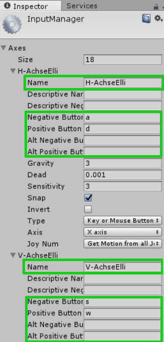
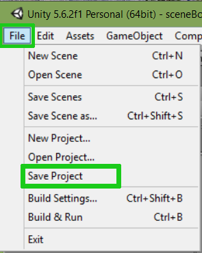
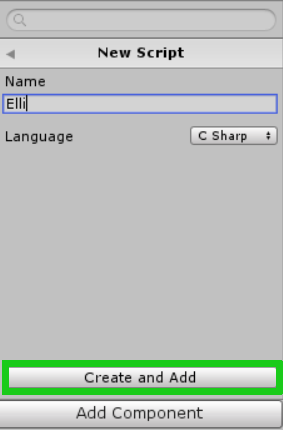

# Teil 3 - Bewegung


In diesem Kapitel wirst du...  |    Erledigt?
-------------------------------|----------------
Die Steuerung deiner Figur einstellen. | 
Die RigidBody 2D Komponente zu deiner Figur hinzufügen. | 
Ein Script schreiben, dass es deiner Figur erlaubt sich zu bewegen. | 
Das Script zu deiner Spielfigur hinzufügen. | 

### Die Bewegung der Elefantin implementieren

Bevor wir mit der Realisierung der Bewegung starten, benennen wir unsere Spielfigur einmal um, damit wir uns später, wenn wir mehrere Figuren haben, besser orientieren können. Ich habe den Namen Elli gewählt. Einfach mit rechten Maustaste draufklicken und auf Rename klicken.


<!-- elefanti verwirrender name? -->

Zuerst kümmern wir uns um die Tasten-Eingabe für die Bewegung. Unter *Edit -> Project Settings -> Input* kann man den *Input Manager* aufrufen. 


Im Input Manager siehst du eine (G)Horizontal Achse und eine (G)Vertikal Achse. Diese benennen wir im ersten Schritt mal um. Ich habe sie hier mit *“H-AchseElli”*  bzw. *“V-AchseElli”* benannt. Diesen Namen brauchen wir später noch beim Programmieren. Bei den Achsen steht jeweils Positive Button und Negative Button mit je einem Feld wo man eine Taste eintragen kann.

Diese Positive/Negative Button macht Sinn sobald du dir ein Koordinatensystem vorstellst. In so einem System ist auf der Horizontal Achse, Positiv nach Rechts, und Negativ nach Links bzw. auf der Vertikalachse, Positiv nach Oben und Negativ nach Unten. Wenn jemand die Taste drückt die bei der HorizontalAchse Positiv Button ist, bewegt sich die Figur nach Rechts.

Du kannst also jetzt die Tasten für die jeweiligen Bewegungsrichtungen eintragen, so wie du denkst die Steuerung ist am Besten. Ein Beispiel hierfür wäre:

- H-AchseElli
    - Negative Button: a
    - Positiv Button: s
    - Type: Key or Mouse Button
- V-AchseElli
    - Negative Button: s
    - Positiv Button: w
    - Type: Key or Mouse Button

!!!bug "WICHTIG"
    Stelle sicher, dass unter Type “Key or Mouse Button” ausgewählt ist, ansonsten funktionieren unsere Einstellungen nicht richtig. 



Da wir gerade die Projekteinstellungen geändert haben, ist es wichtig nun auch das Projekt zu speichern. Das geschieht durch das Anklicken von *File* und *Save Project*.



### Rigidbody2D (G)

Da Elli kein unbewegliches Objekt in unserem Spiel sein wird, brauchen wir eine Komponente(G), die uns hilft Elli zu bewegen, die Bewegungen zu berechnen und sogar die Physik auf sie wirken zu lassen. Glücklicherweise bietet Unity genau so eine Komponente an, die sich um all die Dinge, wie Bewegung, Berechnung physikalischer Vorgänge und Eigenschaften, Kollisionen, elastische Stöße und dergleichen kümmert. Diese Komponente nennt sich Rigidbody2D. Rigid bedeutet so viel wie “starr”, und dass der Körper starr ist, kommt uns sehr gelegen, denn wir brauchen uns nicht darum kümmern, eine ganze Skellettstruktur für Elli zu modellieren.  Einen Rigidbody2D erstellen wir, indem wir im Hierarchy Panel auf Elli draufklicken und dann im Inspector Panel auf der rechten Seite auf *Add Component -> Physics2D -> Rigidbody 2D* klicken.


<!--  -->
<!-- noch zu formatieren -->


Um die Bewegung zu programmieren, benötigen wir ein Script, das der Spielfigur Elli hinzugefügt wird. Dieses Script erstellen wir, indem wir im *Hierarchy Panel* auf Elli klicken und dann im Inspector Panel auf der rechten Seite auf A*dd Component -> NewScript -> Create and Add* (siehe Screenshot) klicken.


<!--  -->
<!-- noch zu formatieren -->


Das eben erstellte Script befindet sich nun im Projekt im Asset Panel. Wir verschieben es jedoch in das Unterverzeichnis Scripts.

Durch einen Doppelklick auf das Script öffnet sich Visual Studio und wir können nun mit dem Programmieren beginnen. 

### Cheat Sheet um Code zu verstehen (sollte 1 seite sein ca)
#### Wiederholung von Grundlagen:

**Kommentar**: In C-Sprachen sind Zeilen, die mit // beginnen, Kommentare. Das sind Texte, die vom Compiler ignoriert werden, also nur für den Programmierer sichtbar sind. Diese Zeilen erklären das Programm für später oder andere Programmierer.

**Variablen**: eine Variable kann wie in der Mathematik einfach Zahlen enthalten. Allerdings gibt es nicht nur *Datentypen* für Zahlen, sondern auch Text. Der Datentyp einer Variable wird in C-Sprachen immer vor dem Namen einer neuen Variable angegeben.
String name = “Jenny”; integer alter = 12; alter = alter + 1;
Diese beiden Variablen “name” und “alter” werden gleich bei der *Deklaration* (erste Definition) mit Werten belegt durch “=”. Das kann auch später passieren. Am Ende dieser Codezeile enthält die Variable “alter” den Wert 13.

**Funktionen**: beinhalten Algorithmen, also Berechnungen in einer speziellen Reihenfolge.
<!-- Definition von Algorithmus VB -->
Eine Funktion ist deshalb so nützlich, weil ein spezielle Berechnung nicht öfters programmiert werden muss, sondern öfters abrufbar ist. Gibt es Daten, die von der Funktion verarbeitet werden müssen (=*Parameter*), werden diese beim Funktionsaufruf in runden Klammern mitgeteilt. Wird im aufrufenden Codestück ein Ergebniswert benötigt, muss die Funktion mit dem Keyword *return* ein Ergebnis zurückliefern! Der Datentyp, der von return geliefert werden muss, steht vor dem Funktionsnamen ( bei der Funktion *integer addieren()*{... return a;} ist der return-Datentyp *integer*!). Liefert eine Funktion nichts zurück, nennt man sie Prozedur. Es entfällt das Keyword “return” am Ende der Prozedur. Als return-Datentyp wird “void” (engl. “nichts”) angegeben. Beispiel:

``` c#
double a = 1.5;	//"double" ist der gängige Datentyp für Kommazahlen
double b = 4.3;	//a und b werden unten als Parameter für die Funktion verwendet
integer c = 0;		//integer kann nur ganze Zahlen speichern. Speichert man darin eine Kommazahl, wird nicht gerundet, sondern die Kommastellen werden einfach gelöscht!
integer addieren_int(double  a, double b) {
	return a + b; //das Zwischenergebnis ist hier 1.5 + 4.3 = 5.8
}
c = addieren_int(a,b);
```

Diese Funktion “addieren_int” addiert zwei Kommazahlen (double) und gibt eine Integer-Zahl (Zahl ohne Kommastellen) zurück. In der Variable “c” ist nachher “5” gespeichert.

**Class**: Klassen sind vom Programmierer und Programmierinnen erstellte Datentypen. Diese enthalten Eigenschaften in Form von Variablen und Algorithmen in Form von Funktionen (etwa eine Funktion, die das Alter erhöht). Zu einer Klasse zugehörige Funktionen nennt man auch *Methoden*. Die Variablen einer Klasse werden auch Member(-variablen) genannt, da sie ohne einem Objekt nicht existieren.
Etwa definiert die Klasse “Katze” die Eigenschaften Farbe, Alter und die Methode gehen(), miauen(), etc. Das Objekt Schnurli ist weiß, 2 Jahre alt und kann gehen und miauen.
Das könnte in C# so programmiert sein:

``` c#
public class Elefant {
	public String farbe;
	public int alter;
	Elefant() { } //Die Methode mit dem selben Namen wie die Klasse nennt man Konstruktor. Er wird hier aber nicht verwendet. Man könnte damit die Variablen oben belegen lassen!
	gehen() { }  //nicht ausprogrammiert 
	troeten(int anzahl) {
		while(anzahl > 0) { 
			Console.WriteLine("Töröööö! "); //In einem Textfenster wird 
								"Töröööö!" ausgegeben
			anzahl--; //der Parameter Anzahl wird reduziert um 1
		}
	}
}
Katze benjamin = new Elefant(); //Dieser Konstruktor erfordert keine Variablen
benjamin.farbe = "grau";
benjamin.alter = 30;
benjamin.troeten(2);
```