# Teil 4 - Levels und Collider

In diesem Kapitel wirst du...  |    Erledigt?
-------------------------------|----------------
Assets für Plattformen importieren |
Eine Plattform zu deiner Spielwelt hinzufügen |
Der Plattform Collider zuweisen und diese anpassen|
Deine erste Plattform in ein GameObject packen, dass du kopieren kannst.|
Mehrere Plattformen in den Spiel kopieren und dein erstes Level designen. |
Deiner Spielfigur einen Polygon Collider zuweisen. |
Spielfeldgrenzen mithilfe von Box Collidern erstellen.|
Eine Vorlage erstellen.|
Einen Boden mit Hilfe eines Scripts und einer Vorlage in deinem Spiel generieren lassen.|

### Unsere neuen Assets importieren und benennen

In diesem Teil wollen wir das Spielfeld, in dem sich die Elefanten bewegen, erstellen. Dazu gehören vorerst die unbeweglichen Spielobjekte und der Hintergrund. Der größte Unterschied zwischen den Spielobjekten und dem Hintergrund ist der, dass die Elefanten mit dem Spielobjekten interagieren können: Spielobjekte können den Elefanten den Weg versperren, einfach als Boden zum drauf stehen dienen oder auch von den Elefanten bewegt werden. 
Als erstes importieren wir die Landschafts-Assets. In unserem Moodle-Kurs findet ihr Assets zum Download, die für die freie Verwendung zur Verfügung stehen. Gerne könnt ihr euch auch eure eigenen Assets erstellen. 

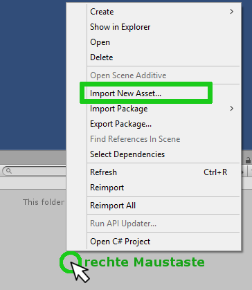


In unserem Beispiel nutzen wir die kostenlosen Tilesets von Game Art 2D. Zu finden unter https://www.gameart2d.com/free-platformer-game-tileset.html 
Kostenlose freie Sprites,  Tilesets und mehr findet man z.B. auf https://www.gameart2d.com/freebies.html. Die Lizenz für die kostenlosen freien Sprites und Tilesets findet ihr unter https://www.gameart2d.com/license.html.    

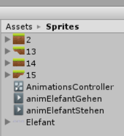

Im Heruntergeladenen Ordner navigieren gehen wir zu freetileset/png/Tiles, importieren die Dateien mit den Nummern 2, 13, 14 und 15 und benennen Sie folgendermaßen um:
2 -> Boden 
13 -> Plattform_Links
14 -> Plattform_Mitte
15 -> Plattform_Rechts

Das Ergebnis sollte in etwa so aussehen:

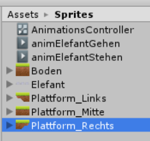

Die Plattformen ziehen wir einfach via Drag-and-Drop in die Spiel-Szene hinein.
Die Plattformen sind wahrscheinlich zu groß, aber das können wir wieder mit dem Feld Pixels Per Unit anpassen. 170 Pixels per Unit ist ein guter Wert für unsere Plattformen.

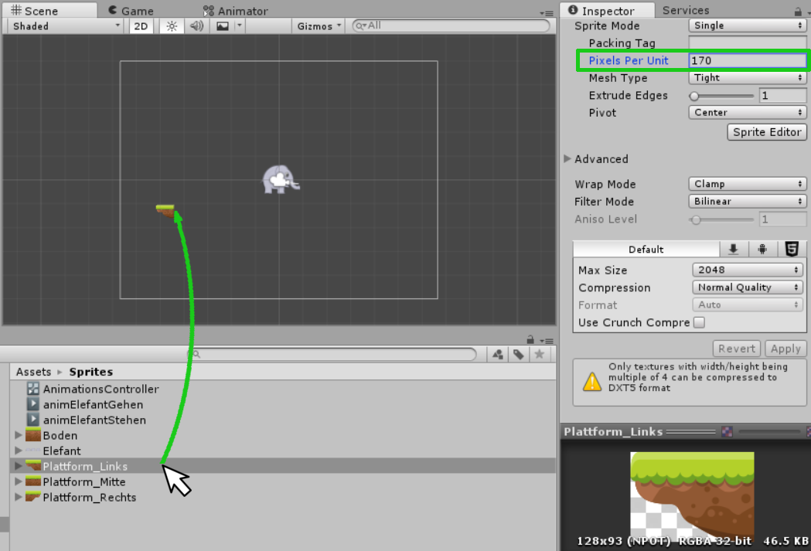


In der Spielszene kannst du die Plattformen auf zwei Arten verschieben: Entweder du verschiebst die Plattformen mit dem Verschiebepfeil   oder indem du Werte für X und Y im Inspector Panel unter Transform bei der Position eingibst. Diese Werte entsprechen der Position in einem Koordinatensystem.

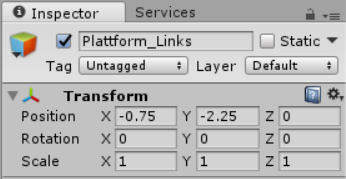

### Physik und Collider

Ändern wir nun wieder bei Elli im Inspector Panel die Gravity Scale auf 1 und drücken auf Play, dann fällt die Elefantin wieder ins Bodenlose durch die Plattform. Der Grund dafür liegt darin, dass die Plattform noch kein Teil der physikalischen Welt ist. Genau genommen liegt die Ursache darin begründet, dass wir noch keine Collider für die Plattformteile angelegt haben. Ohne Collider ist unsere Plattform nämlich einfach ein Hintergrundobjekt, an dem andere Objekte einfach vorbeiziehen.

####Collider
Collider stellen in Unity Grenzen für die Kollisionserkennung zur Verfügung. Überschneiden sich die Grenzen von zwei Objekten die Teil der Physik Welt sind, dann wird eine Kollision ausgelöst, dass wird beispielsweise dazu eingesetzt, dass ein Objekt von einem anderen Objekt abprallt oder nicht hindurch kann.

Es gibt in Unity unterschiedliche Arten von Collidern: 

 * Box Collider
 * Circle Collider 
 * Edge Collider (für Ränder)
 * Composite Collider 
 * Capsule Collider 
 * Polygon Collider

Die einfachsten Collider sind Box Collider und Circle Collider. Mit Einfachheit ist nicht nur die Einfachheit der Form gemeint, sondern auch, wie einfach Kollisionsereignisse zu berechnen sind. Bei Box und Circle sind Kollisionsereignisse mit weniger Aufwand zu berechnen, als bei komplizierten Formen, die etwa Polygon-Collider verwenden. Deshalb sollte man nach Möglichkeit eher einfache Collider verwenden. Verwendet man zu viele komplizierte Collider kann dies die Framerate verringern, bzw. zu Ruckeln führen.

Um das Konzept des Geschwindigkeitsvorteils von einfachen Collidern anzuwenden, fügen wir der Plattform_Links nun statt einem Polygon Collider, zwei Box Collider hinzu. 
Dafür klicken wir im Inspector Panel auf AddComponent ->Physics2D->Box Collider 2D.
Wir optimieren noch das Offset (Position) und die Werte bei Size (Größe). Bei mir haben diese Werte gut ausgesehen, aber es kann gut sein, dass in deinem Spiel ein paar Dinge anders sind.  

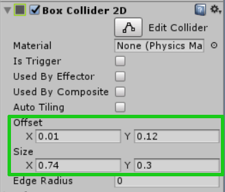
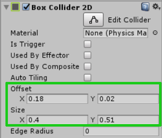


Alternativ kann man auch auf den Button neben Edit Collider klicken und den Collider durch Ziehen mit der Maus anpassen.

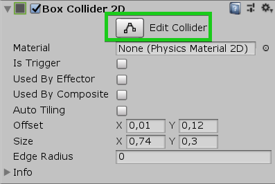 

Nachfolgend unser Plattformteil mit den Collider-Grenzen der zwei Box-Collider in grün.

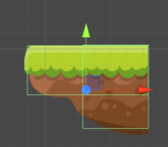

Anmerkung: Zuvor habe ich über das Konzept des Geschwindigkeitsvorteils bei Collider geschrieben. Ich habe deswegen zuvor in der Formulierung das Konzept verwendet, weil in der Praxis so einfache Objekte wie unsere Plattformen, noch dazu, wenn sie in so geringer Zahl sind und sich darüber hinaus statisch, also fix in der Landschaft sind, locker mit der Rechenleistung von älteren Computern, Konsolen oder Smartphones auskommen. Dennoch halte ich es für wichtig, dass man gerade im Simulationsbereich oder im Bereich der Computergrafik über Effizienz von Berechnungen oder Algorithmen ein wenig nachdenkt. 

Für das mittlere Plattformstück reicht ein einzelner Box Collider. Für das rechte Plattformobjekt habe ich diesmal die Box Collider nicht überschneidend sondern einfach übereinandergelegt gestaltet.

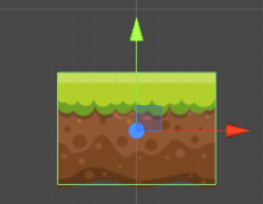
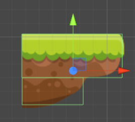

Abschließend machen wir uns noch das weitere Gestalten des Levels leichter, indem wir ein neues Game Objekt erstellen in das wir alle drei Teile der Plattform hinein verschieben, so dass sie gruppiert sind. Dazu klicke ich mit der rechten Maustaste in das Hierarchy Panel und wähle aus dem Kontextmenü Create Empty. Das neue GameObject benennen wir dann gleich in "Plattform" um und schieben die einzelnen Plattformteile in das GameObject Plattform. Das geht am besten indem man alle 3 Plattformteile markiert indem man STRG hält und sie anklickt und anschließend auf das Gameobject Platform zieht. Am Screenshot unten, sieht man wie das Endergebnis aussehen soll. Die so gruppierten Plattformen kann man nun einfach mit der rechten Maustaste duplizieren und beliebig am Spielfeld verteilen.

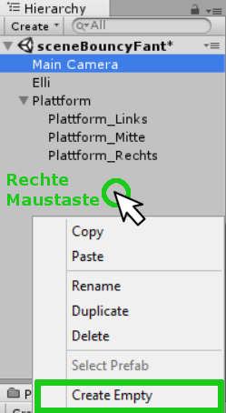
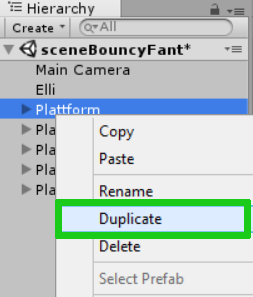

Am Ende sollte das Spielfeld in etwa so aussehen:

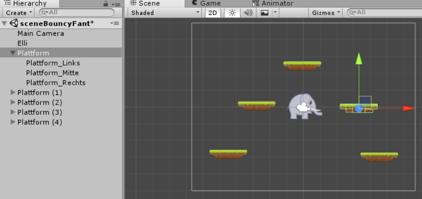

Das graue Rechteck stellt den momentanen Kameraausschnitt dar. Dieser Ausschnitt bestimmt wie viel Platz wir am Spielfeld haben. Ist uns der Platz am Spielfeld zu gering, so können wir einfach durch einen Klick auf Main Camera (zu finden in der Hierarchy) die Eigenschaften der Kamera im Inspector anzeigen. In den Eigenschaften ändern wir einfach die Größe (Size) auf einen höheren Wert, z.b. 7. 

Der Elefantendame Elli gönnen wir am Ende noch einen Polygon Collider. 

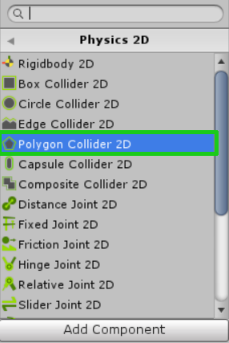

Beim Hauptcharakter unseres Spiels kann man schließlich ein wenig mehr Rechenaufwand in Kauf nehmen und die genauen Grenzen, wie etwa beim Rüssel, machen dann die ganze Physik-Simulation viel spaßiger beim Spielen.

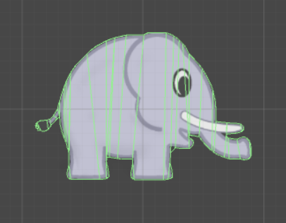

##Spielfeldgrenzen

Um das Spielfeld zu begrenzen gibt es mehrere Möglichkeiten:

1. Wir fügen einen Collider zur Kamera hinzu.
2. Wir erstellen für jede Spielfeldgrenze ein eigenes Game Object und fügen dem Objekt den jeweiligen Collider hinzu.
3. Wir erstellen ein einziges Game Object und fügen diesem Objekt alle vier Spielfeldbegrenzungen zu.
In diesem Beispiel wählen wir Variante 3, erstellen einen neues Game Object, benennen es in Spielfeldgrenzen um und fügen dem soeben erstellten Objekt vier Box Collider 2D hinzu.

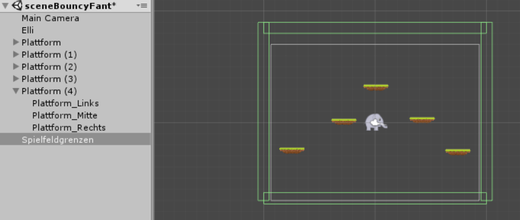

Wie man sehen kann, gehen die Spielfeldgrenzen oben ein wenig über den Bildauschnitt, den die Kamera darstellt, hinaus. Dadurch können die Elefanten nach oben ein wenig über den Rand hinaus springen was vom Spiel-Feeling her ganz angenehm ist.

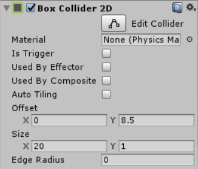

Position des Colliders | Offset X | Offset Y | Size X | Size Y |
-----------------------|----------|----------|--------|--------|
Oben| 0 | 8.5 | 20 | 1 |
Unten | 0 | -6.8 | 20 | 1 |
Links | -9.6 | 1 | 1 | 16 |
Rechts | 9.6 | 1 | 1 | 16 |

##Bodenlegen 
Jetzt fällt Elli zumindest nicht mehr aus dem Spielfeld heraus. Doch auf einem unsichtbaren Bodens gehen hat nur halb so viel Stil. Deshalb werden wir uns jetzt einen schönen Boden legen, der sich genau mit der Grenze des unteren Spielfeldcolliders deckt. 
Zuerst änderen wir die Größe des Sprites für den Boden auf 170 pixels per unit  und ziehen dann das Boden-Sprite in die Szene hinein. Das Ganze machen wir nun in etwa 30 Mal. Dabei bekommt man richtig viel Übung ;-)  Halt, Nein, Scherz! Als InformatikerInnen lieben wir Effizienz und elegante Konstrukte und deshalb verwenden wir für das Erstellen der weiteren Bodenteile eine Schleife.

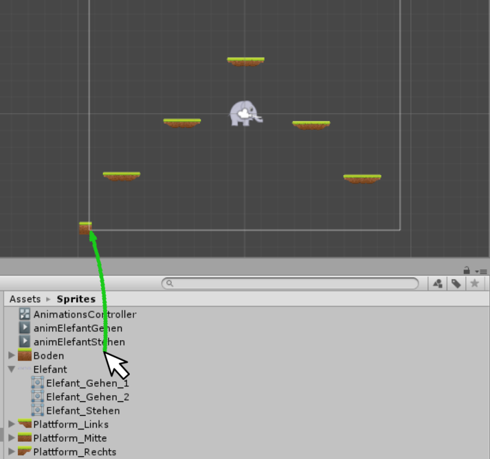


## Vorlagen
Wollen wir mittels Script neue Objekte erstellen, dann können wir uns Arbeit ersparen, indem wir Vorlagen verwenden. In Unity werden Vorlagen auch Prefabs genannt. Eine Vorlage erstellt man einfach dadurch, dass man aus dem Hierarchy Panel ein vorhandenes Game Object in das Asset Panel zieht. Wir ziehen also das Game Object  Boden in das Verzeichnis Vorlage (das wir hoffentlich bereits erstellt haben) und schon haben wir eine Vorlage.

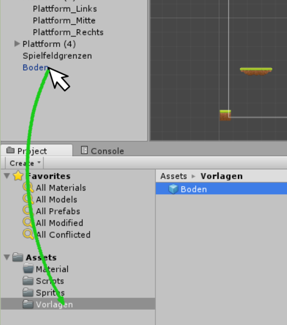

Dem Objekt Spielfeldgrenzen fügen wir nun mittels Add Component ein neues Script hinzu, das wir Spielfeld nennen. Dieses Script verschieben wir auch gleich wieder in den Ordner Scripts.

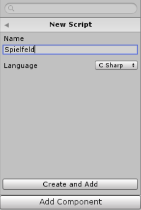

Das Script klicken wir doppelt an und nun sollte sich Microsoft Visual Studio öffnen. In Visual Studio löschen wir im Script Spielfeld zuerst die Prozedur Update. Dann fügen wir gleich unter der Klassendefinition unser Spielobjekt namens Boden hinzu und speichern das Script mit Strg+s. Das GameObject Boden entspricht dann beim Programmieren unserer Vorlage Boden die wir vorhin erstellt haben. 

``` c#
public class Spielfeld : MonoBehaviour {
    public GameObject Boden;
```
Ganz wichtig ist es dem Feld Boden das bei uns in Unity Inspector auftaucht, nun auch die Vorlage zuzuweisen. Dies bewerkstelligen wir, indem wir die zuvor angelegte Vorlage in das entsprechende Feld im Script ziehen.  


!!!bug "Achtung" 
	Scheint das Feld Boden beim Script nicht auf, liegt das evtl. daran, dass das Script noch nicht gespeichert wurde.
	
Schließlich erstellen wir die Prozedur für das Zeichnen des Bodens. Dabei wird neuer Boden von unserer Vorlage Boden instanziiert und eine bestimmte Position gesetzt. Diese Position kommt auf die Werte innerhalb von ``` new Vector3(x * 0.75f, -6.81f, -4) ``` an. Die Werte entsprechen den Koordinaten (x,y,z) in einem Koordinatensystem . Beim Aufrufen unserer Funktion ```ZeichnenBoden(int x)``` wird eine Zahl x übergeben und je nachdem welche Zahl x ist, wird unser Boden an einer andere Stelle erschaffen. Wenn wir die Zahl 1 übergeben, ist die Position (0.75, 6.81, -4) und wenn wir 2 übergeben ist die Position (1.5, -6,81, -4).


``` c#
// In dieser Prozedur wird der Boden gezeichnet
public void ZeichnenBoden(int x)
{
   Instantiate(Boden, new Vector3(x * 0.75f, -6.81f, -4), Quaternion.identity);
}
```	
	
!!!bug "Tipp"  
	Wir befinden uns im 2D Modus, also gibt es keine Z Koordinate. Wir könnten also statt -4 irgendwas schreiben, das macht keinen Unterschied. Solltest du aber irgendwann mal ein 3D Spiel machen wollen, musst du auch bei der Z Koordinate etwas berechnen.
		
	
## Aufgabe 
Füge in die vorhandenen Prozedur Start eine Schleife ein, die die Bodenstücke am am unteren Rand des Spielfelds automatisch zeichnet. 


``` c#
// Initialisierungen
void Start ()
{
    // In dieser Schleife wird der Boden gezeichnet
    /*** Hier den Code für die Schleife einfügen ***/ 
}
```	
Eine mögliche Lösung sieht so aus:
``` c#
for (int i = -20; i <= 20; i++) ZeichnenBoden(i);
```	
Obige Version ist die Kurzform und gleichwertig mit der Langform mit den geschwungenen Klammern:
``` c#
for (int i = -20; i <= 20; i++)
{
    ZeichnenBoden(i);
}     
```	
Zum Abschluss noch einmal der ganze Quellcode des Scripts Spielfeld.cs:

``` c#
using System.Collections;
using System.Collections.Generic;
using UnityEngine;

public class Spielfeld : MonoBehaviour {
    public GameObject Boden;

	// Initialisierungen
	void Start ()
    {
        // In dieser Schleife wird der Boden gezeichnet
        for (int i = -20; i <= 20; i++) ZeichnenBoden(i);
    }

    // In dieser Prozedur wird der Boden gezeichnet
    public void ZeichnenBoden(int x)
    {
        Instantiate(Boden, new Vector3(x * 0.75f, -6.81f, -4), Quaternion.identity);
    }
}
```

Das Resultat sieht dann so aus:

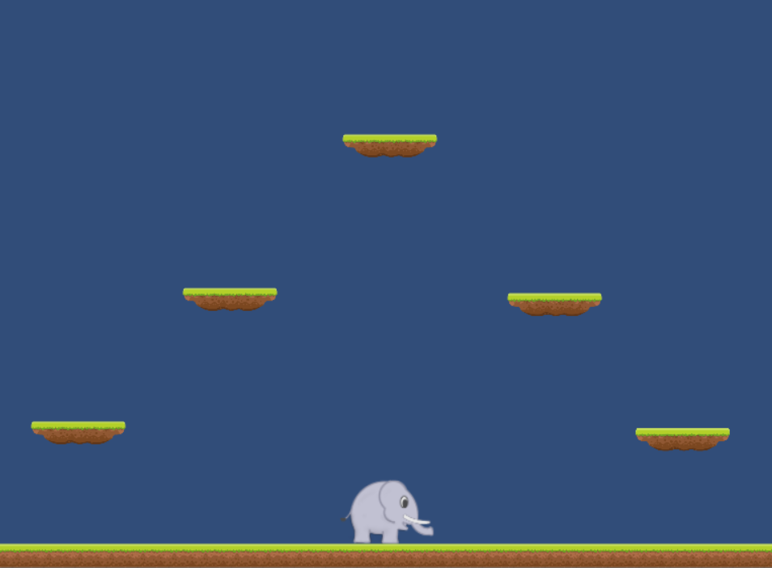{: style="height:60%;width:60%"}

## Hintergrund und Abschlussaufgaben

Zum Abschluss haben wir die letzten Schritte des Leveldesign als Übung für dich ausgedacht. Dabei geht es darum Dinge anzuwenden, die in diesem Kapitel besprochen wurden. 

### Aufgabe 1
Füge der Spieleszene den Hintergrund BG.png aus freetileset_jungle\png\BG (Download)  hinzu. 
In Moodle wird man dann die Lösung ein/ausblenden können.

#### Lösung Aufgabe 1
Rechtsklick in den Asset Panel->Import New Asset. Auswählen von freetileset_jungle\png\BG\BG.png

Die Grafik vom Projektbereich in das Hierarchy Panel ziehen und in “Hintergrund” umbenennen.
Die Grafik (Hintergrund) anklicken und anpassen. Dazu im Inspector folgende Werte setzen:
Position: X=0, Y=0, Z=10
Größe: Im Inspector Scale auf folgenden Werte setzen: X=2, Y=2, Z=1. Fertig!
Eventuell, musst du im Inspector bei Sprite Renderer “Order in Layer” auf -1 setzen. Dadurch ist dein Hintergrund auf einem eigenen Layer hinter den anderen Objekten.
### Aufgabe 2
Füge die Grafik Tree3.png aus dem freetileset_jungle\png\Object zur Spielszene hinzu und Weise dem Baum einen Polygon Collider 2D zu. 


#### Lösung Aufgabe 2:

Rechtsklick in den Asset Panel->Import New Asset. Auswählen von freetileset_jungle\png\Object\Tree_3.png
Die Grafik vom Projektbereich in die Hierarchy ziehen und in Baum umbenennen.
Die Grafik (Hintergrund) anklicken und anpassen. Dazu im Inspector folgende Werte setzen:
Position: X=0, Y=-3.8, Z=10
Größe: Im Inspector Scale auf folgenden Werte setzen: X=2, Y=2, Z=1. Fertig!
In der Hierarchy den Baum anklicken und im Inspector über Add Component->Physics 2D->Polygon Collider 2D  den Collider hinzufügen! Fertig!

!!!bug "Pro-Tipp"
	Wenn man möchte, dass die Objekte im Spielfeld ein wenig in der Baumkrone verschwinden, dann kann man die Größe des Objekts z.B. Tree_3 zuerst auf einen höheren Wert setzen (z.B. 110) und dann den Collider hinzufügen. Ein höherer Wert bei Pixelgröße bedeutet ja, dass der Baum kleiner dargestellt wird. Dadurch haben wir einen etwas kleineren Baum mit einem kleineren Collider. Wenn wir jetzt die Pixelgröße wieder auf den ursprünglichen Wert von 100 zurücksetzen, dann bleibt der Collider kleiner als die graphische Darstellung des Baums. Der Collider skaliert nämlich nur dann mit, wenn ich die Größe eines Spielobjekts via Transform/Scale ändere. Für das Finetuning könnte man noch das Offset des Polygon Colliders anpassen, z.B. indem wir Y=-0,1 setzen. Abschließend setzt man noch den Z-Wert des Baums auf einen niedrigeren Z-Wert, als den Wert der anderen Spielobjekte (z.B. -2).

Sourcecode
Download Sourcecode Teil 04: [http://comber.at/dev/BouncyFant04.zip](http://comber.at/dev/BouncyFant04.zip)

	