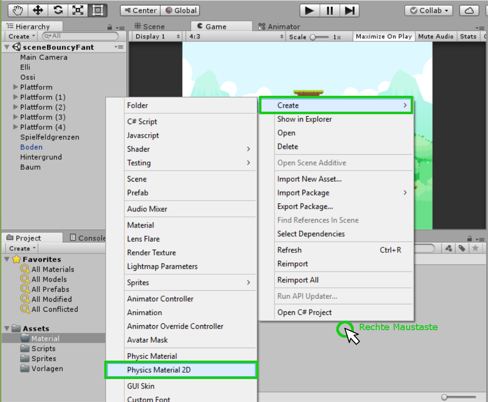
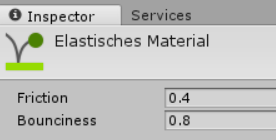
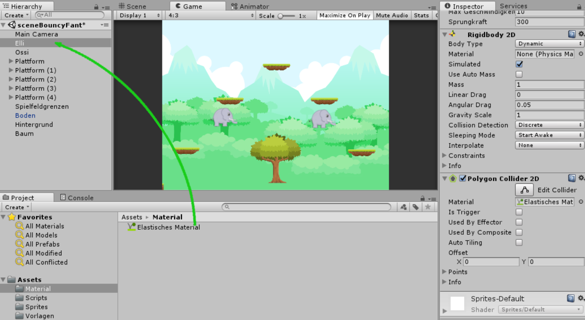

# Teil 6 - Jump around!

Nun geht es darum, den Elefanten die Fähigkeit zu verleihen, am Spielfeld wie Flummis herumzuspringen. Das Spiel heißt schließlich ja Bouncy Fant.  
Dafür wirst du ...

* ... eine Methode implementieren, die feststellt ob ein Elefant gerade am Boden steht oder in der Luft ist.
* ... eine Methode implementieren, die die Elefanten springen lässt.
* ... ein Material erstellen, dass die Elefanten elastisch wie Hüpfbälle macht

!!! Abstract "Lernziele"
    In diesem Kapitel lernst du, wie man eine Sprungmechanik implementieren kann. Außerdem lernst du, wie du Materialien in Unity verwenden kannst um die Elefanten elastisch zu machen.


## Springen

### Sprungkraft
Erstelle zuallererst in BouncyFant.cs eine Variable für die Sprungkraft. Diese Variable soll festlegen wie hoch die Elefanten springen können. Setze diese Variable auf 300. (Du kannst auch gerne mit einer höheren oder niedrigeren Sprungkraft experimentieren)

```C#
  public class BouncyFant : MonoBehaviour {
    protected Rigidbody2D Elefantenkoerper;
    protected Animator Animation;
    public float MaxGeschwindigkeit = 10;
    public float Sprungkraft = 300;
```

### Feststellen, ob sich der Elefant am Boden befindet
Die Elefanten sollen grundsätzlich nur dann springen können, wenn sie auf einem Objekt stehen, von welchem sie abspringen können.  Könnten Ossi und Elli nämlich aus der Luft nochmal los springen, wäre das ziemlich gecheatet.  Es spricht aber nichts dagegen, dass man in einem anderen Spiel, einem anderen Level unseres Spiels oder bei Boostern, so ein Feature (z.B. Double Jump, oder ein Art Flappybird-Mechanik) einbaut.
Die [Methode](/0220-functions/0220-functions) AmBoden() stellt fest, ob sich direkt unter dem Elefanten ein Collider befindet. Baue diese Methode in das Script BouncyFant.cs ein, damit sie allen Elefanten zur Verfügung steht.

```C#
// Feststellen, ob der Elefant am Boden ist.
protected bool AmBoden()
{
    // Abfragen der Grenzen der Kollisionsobjekte
    Bounds Grenze = GetComponent<Collider2D>().bounds;
    float Spielraum = Grenze.size.y * 0.1f;

    // Berechnen einer Position die ein wenig unter der Kante des Kollisionsobjekts liegt
    // sonst kann es vorkommen, dass der Elefant nicht springen kann, wenn er ganz still steht.
    Vector2 v = new Vector2(Grenze.center.x, Grenze.min.y - Spielraum);

    // Kollisionsabfrage:  mittels einer Linie  
    RaycastHit2D Kollision = Physics2D.Linecast(v, Grenze.center);

    // "true" zurückgeben, wenn das Kollisionsobjekt nicht der Elefant selbst ist.
    return (Kollision.collider.gameObject != gameObject);
}
```

 Füge darunter auch die Methode Springen() ein.

```C#
// Springen
protected void Springen(KeyCode Taste)
{
    // Herausfinden, ob der Elefant irgendwo steht, von wo er abspringen kann
    bool springenmoeglich = AmBoden();

    /* Wenn der Pfeil nach oben gedrückt wird und Springen möglich,
     * d.h. der Elefant hat etwas, von wo er aus wegspringen kann,
     * dann bekommt der Elefantenkörper einen Impuls (Addforce),
     * entsprechend der von uns gewählten Sprungkraft
     */
    if (Input.GetKey(Taste) && springenmoeglich)
        Elefantenkoerper.AddForce(Vector2.up * Sprungkraft);

    /*
     * Wenn der Elefant gerade springt, dann springen auf nicht möglich setzen.
     * Nicht = Rufzeichen(!).
     */
    Animation.SetBool("Springen", !springenmoeglich);
}
```

Unsere Elefanten rufen die Prozedur Springen mit der entsprechenden Taste in Klammer, mit der gesprungen werden soll, in FixedUpdate() auf.

```C#
Elli
void FixedUpdate()
{
    Gehen(Input.GetAxis("H-AchseElli"));
    Springen(KeyCode.W);
}

Ossi
void FixedUpdate()
{
    Gehen(Input.GetAxis("H-AchseOssi"));
    Springen(KeyCode.UpArrow);
}
```

## Elastisches Material
Um Dinge wie Elastizität in Unity zu realisieren verwendet man ein Material, welches man den Collidern eines Objekts hinzufügt. Erstelle ein neues Material und gib ihm einen aussagekräftigen Namen (z.B. Elastisches Material)



Experimentiere mit verschiedenen Werten zwischen 0 und 1 bei der Bounciness (Elastizität), bis du einen Wert gefunden hast, mit dem du zufrieden bist.



Das Material kann man einem Objekt zuweisen, indem man es einfach auf das GameObject zieht.  Es erscheint dann auch automatisch beim Polygon Collider 2D als Material.



---

#### Sourcecode
[Download Sourcecode Teil 06](https://github.com/learn2proGrAME/proGrAME-Beispiele-und-Quellcodes/blob/master/BouncyFant/T06/Bouncy%20Fant%2006.zip)
