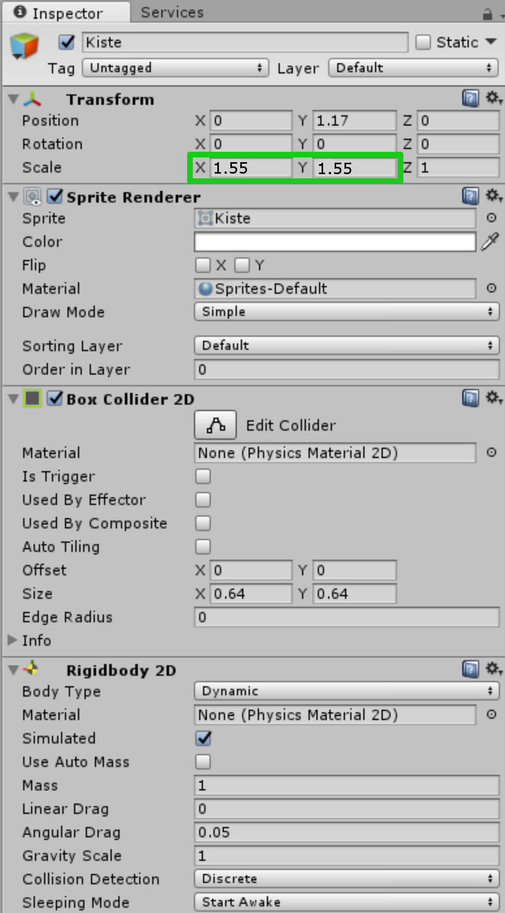
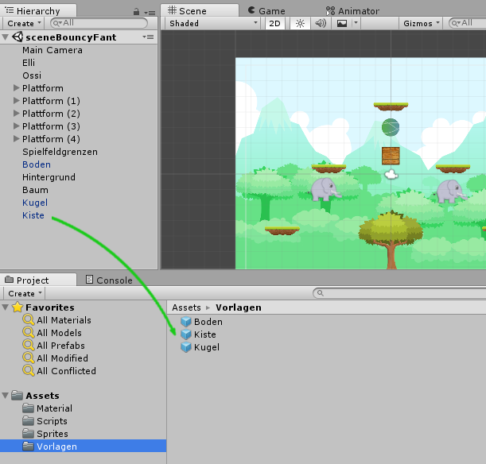
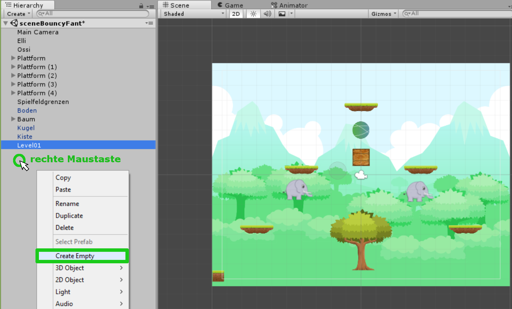
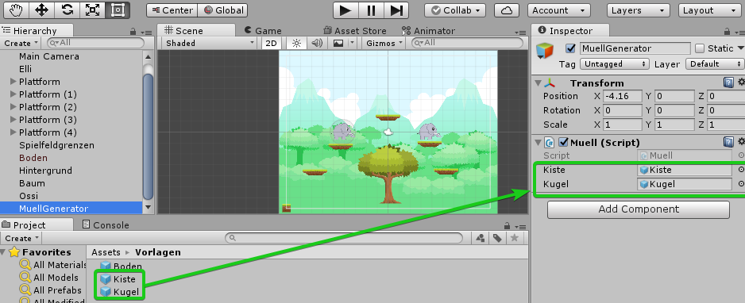

# Teil 7 - Physik

!!!Abstract "Ziele"
    Wer die Background Story unseres Spiels gelesen hat, weiß, dass der böse Dr. Scramblewoods alles daran setzen wird, Elli und Ossi daran zu hindern, seine Maschinen zu deaktivieren und den Regenwald zu retten. Deshalb legt Dr. Scramblewoods den Bouncy Fants alle möglichen Hindernisse in den Weg. Im ersten Level lässt er sperrige Kisten und Kugeln auf sie herab regnen, damit sie den magischen Pilz nicht erreichen.


In diesem Kapitel wirst du... | Erledigt?
----------------------------- | ---------
Kugeln und Kisten als Hindernisse für die Elefanten erstellen |
Den Unterschied zwischen Skalierung und Änderung der Pixel per Unit zur Veränderung der Größe eines Objekts verstehen |
Ein Script schreiben, das Kugeln und Kisten vom Himmel herabregnen lässt. |

## Hindernisse hinzufügen
Um den herabfallenden Sperrmüll zu erstellen, lege wieder jeweils ein neues Asset (*Import New Asset*) im Projektbereich an und  ziehe die Kisten und Kugeln in die Spieleszene. Den Link zu den Assets die du dafür verwenden kannst, findest du in [Kapitel 2](/0280-bouncyfant/T02-animstat)

Sowohl Kugel als auch Kiste bekommen einen entsprechenden Collider (die Kugel einen Circle Collider und die Kiste einen Box Collider) zugewiesen. Füge den Kisten und Kugeln einen *RigidBody2D* hinzu, damit sich die Kisten und Kugeln auch bewegen können und nicht starr im Level verharren.


### Skalieren
Die Größe von Kiste und Kugel haben wir in unserem Spiel noch um den Faktor 1,55 jeweils auf der X- und Y-Achse skaliert.

{: style="height:50%;width:50%"}

!!!Tip "Pro-Tipp:"
    Ganz allgemein ist es im Spiel sinnvoll, wenn man die Größe der Objekte im Spiel durch die Skalierung ändert. Diese Art der Größenänderung wirkt sich nämlich auch auf die Größe des Colliders aus.  Würden wir die Größe von Elli, jetzt wo wir bereits den Collider hinzugefügt haben, mit Hilfe der Pixelgröße (Pixels per Unit im Sprite) verkleinern, dann würde der Collider gleich groß bleiben. Das hätte zur Folge, dass Elli bereits an Objekten anstößt bevor sie diese berührt und nicht weiter kann, da der Collider bereits eine Kollision meldet.

Nun ziehen wir das zuvor erstellte elastische Material aus dem Ordner *Material* auf die Kisten auf die Kugel, damit diese auch herumspringen. Um viele Kisten und Kugeln zu erstellen, kreieren wir uns wieder eine Vorlage. Zu diesem Zweck ziehen wir die Kugel und die Kiste in den Ordner *Vorlagen*.



Jetzt fehlt noch die Implementierung für die herabfallenden Gegenstände. Damit wir schon jetzt unser Spiel dafür vorbereiten, dass es unterschiedliche Level geben wird, erstellen wir ein neues *GameObject* mit dem Namen *Level01*.



Wir erstellen im GameObject *Level01* ein Script und nennen es *Muell.cs*. Dieses Script soll so aussehen (der Quellcode wird später noch im Detail genau erklärt).

```C#
using System.Collections;
using System.Collections.Generic;
using UnityEngine;

public class Muell : MonoBehaviour {

    // Konstanten für die Maximalanzahl der Kisten definieren
    const int MAXANZAHLKISTEN = 30;
    const int MAXANZAHLKUGELN = 45;

    // Zählvariablen Kisten
    int Anzahlkisten = 0, Anzahlkugeln = 0;

    // Erstellen der GameObjekte für Kisten und Kugeln
    public GameObject Kiste;
    public GameObject Kugel;


    // Initialisierungen
    void Start()
    {
        InvokeRepeating("ErzeugeKiste", 1, 1);
        InvokeRepeating("ErzeugeKugel", 0.5f, 1);
    }

    // Erzeuge an einer Zufallsposition eine Kugel
    void ErzeugeKugel()
    {
        if (Anzahlkugeln < MAXANZAHLKUGELN)
        {
            // Zufallszahl zwischen dem linken und dem rechten Rand generieren
            int x = (int)Random.Range(-13, 13);

            // Instanzieren der Kugel an der Position x,y
            Instantiate(Kugel, new Vector2(x, 8.0f), Quaternion.identity);

            // Anzahl der Kugeln um 1 erhöhen
            Anzahlkugeln++;
        }
    }
    // Erzeuge an einer Zufallsposition eine Kiste
    void ErzeugeKiste()
    {
        if (Anzahlkisten < MAXANZAHLKISTEN)
        {
            // Zufallszahl zwischen dem linken und dem rechten Rand generieren
            int x = (int)Random.Range(-13, 13);

            // Instanzieren der Kiste an der Position x,y
            Instantiate(Kiste, new Vector2(x, 8.0f), Quaternion.identity);

            // Anzahl der Kugeln um 1 erhöhen
            Anzahlkisten++;
        }
    }
}
```

Wenn alles gespeichert ist, weisen wir im Inspector dem *Level01* die Vorlagen den Variablen *Kiste* und *Kugel* zu.

{: style="height:50%;width:50%"}

##Sourcecode
Download Sourcecode Teil 07: http://comber.at/dev/BouncyFant07.zip
