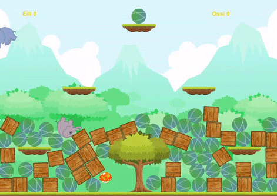
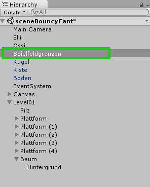
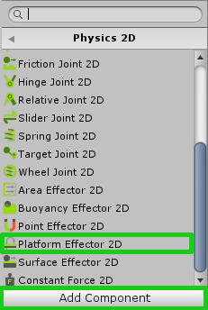
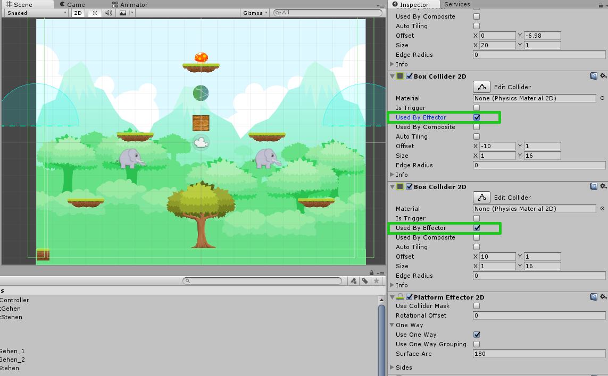

# Teil 9 - Finetuning

!!!Abstract "Ziele"
    Einen Platform Effector hinzufügen, damit die Figur nicht an der Wand hängen bleibt.

In diesem Kapitel wirst du... | Erledigt?
----------------------------- | ----------
Lernen wie man einen PlatformEffector verwendet |

## Platform Effector
Momentan ist das Spiel schon ganz gut spielbar, doch eine Kleinigkeit trübt noch die Freude. Wenn man mit dem Elefanten gegen die Wand springt und dann gleichzeitig die Richtungstaste weiter in diese Richtung gedrückt hält, dann bleibt die Spielfigur in der Luft hängen.

Um das Hängenbleiben zu vermeiden, bringen wir einen *Platform Effector* zum Einsatz. Dazu klicken wir zuerst im der Hierarchy auf die *Spielfeldgrenzen* und dann im Inspector auf *Add Component/Physics 2D/Platform Effector 2D*

Haben wir den Effector den Spielfeldgrenzen hinzugefügt, erhalten wir vorerst noch eine Warnung, dass der Effector erst funktionieren wird, wenn er von einem Collider verwendet wird.

Daher klicken wir bei den entsprechenden Spielfeldgrenzen, nämlich den Wänden links und rechts, einfach auf *Used by Effector* und schon sollte der Elefant, wenn wir das Spiel starten,nicht mehr in der Wand hängen bleiben, sondern nach unten rutschen.

Für’s erste war es das einmal mit unserem Tutorial. Schön, dass ihr dabei wart. Man könnte auch sagen, jetzt geht es erst richtig los: Neue Levels, neue Features, neue Spielfiguren, …  
Lasst eurer Fantasie freien Lauf.

**Have Fun!**

-----

####Sourcecode
[Download Sourcecode Teil 09](https://github.com/learn2proGrAME/proGrAME-Beispiele-und-Quellcodes/blob/master/BouncyFant/T09/Bouncy%20Fant%2009.zip)
