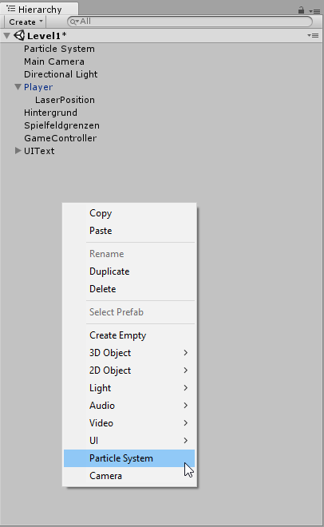

#Partikelsysteme

!!! Abstract "Lernziele"

    In diesem Kapitel lernst du was Partikelsysteme (particles) sind und wofür sie verwendet werden. Außerdem wirst du für das Spiel *Space-Asteroids* einen Partikeleffekt für den Raketenantrieb des Raumschiffs erstellen.
-----

Partikelsysteme werden in Computerspielen für zum Beispiel folgende Dinge verwendet:

* Flüssigkeiten (Wasserfälle, Flüssigkeitsspritzer)
* Explosionen
* Feuer
* Rauch, Dampf, Nebel
* Feuerwerk

{: style="height:40%;width:40%"}
{: style="height:40%;width:40%"}
{: style="height:40%;width:40%"}
{: style="height:40%;width:40%"}

##Funktionsweise

Die Funktionsweise ist dabei ganz einfach. Ein Partikelsystem besteht aus Partikeln und einem sogenannten Emitter.

###Partikel
Partikel sind kleine Sprites oder 3D Objekte.  
In der oben zu sehenden Explosion ist zum Beispiel jeder einzelne Funke ein Partikel. Außerdem besteht der Rauch auch aus ganz vielen kleinen grauen Sprites.

###Emitter
Die Aufgabe des Emitters (to emit = ausstoßen) ist es, ganz viele Partikel nach einem bestimmten Schema auszustoßen um damit den Effekt zu erzielen.
Im oben zu sehenden Feuer stößt der Emitter ganz viele kleine orange Partikel für das Feuer aus. Wenn diese sich überlappen, werden sie heller. Damit wird der Flammeneffekt erzeugt.

!!!Tip "Hinweis"
	In Unity gibt es für den Emitter keine eigene Komponente, er ist Teil der Komponente *Particle System*
	
##Erstellung eines Partikelsystems in Unity

Nun wirst du dein eigenes Partikelsystem für das Spiel *Space-Asteroids* erstellen.

Falls du das Tutorial [Spiel - Space-Asteroids](../0240-spaceshooter/0240-spaceshooter.md) schon absolviert hast, verwende nun dieses Unityprojekt, ansonsten kannst du dir [hier](https://github.com/learn2proGrAME/SpaceShooter) das Projekt herunterladen.

1. Erstelle ein neues Partikelsystem. In der Hierarchy *Rechte Maustaste->Particle System*

Nun siehst du in der Sceneview dein neues Partikelsystem und es stößt bereits weiße Partikel aus.

