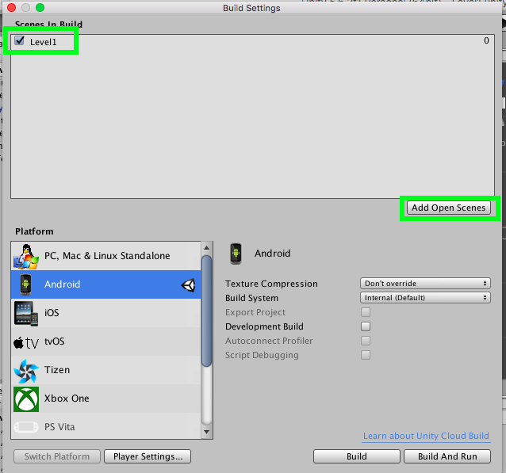

#Spiele für Smartphones und Tablets

!!! Abstract "Lernziele"

    In diesem Kapitel lernst du wie du ein Unity Projekt für Android bzw. IOS veröffentlichst.
-----

##Voraussetzungen

###Android:
Android SDK, sowie Java JDK 1.8 (Höhere Versionen werden zur Zeit nicht ohne weiteres unterstützt) müssen installiert sein. Außerdem muss man in Unity unter *Edit->Preferences* den Pfad zu diesen Paketen angeben.

###IOS:
Das IOS-Modul muss installiert sein.

##Zielplatform ändern
Gehe zu *File->Build Settings* und wähle als Platform Android bzw. IOS aus.

##Live Testen mit Unity-Remote
Wenn du dein Spiel während dem arbeiten auf dem Smartphone testen willst, kannst du die *Unity-Remote* App auf deinem Smartphone installieren. (Die Findest du im PlayStore bzw. Appstore)
###Android
Damit die App funtkioniert musst du allerdings *USB-Debugging* auf deinem Android-Smartphone aktivieren. Außerdem musst du *Device* unter *Edit->Project Settings->Editor* *Any Anrdoid Device*

Wenn du nun Play drückst, dein Smartphone an den PC angschlossen ist und die Unity-Remote läuft, sollte das Spiel auch auf deinem Smartphone laufen.

##Spiel exportieren

Um das Spiel nun für das Smartphone zu exportieren gehe wieder auf *File->Build Settings*. Klicke dann auf *Player Settings* und gib einen Companyname und Productname für dein Spiel ein. Setze dann unter *Other Settings* den Package Name auf "com.*deinProductName*.*deinCompanyName*" (ohne Anführungszeichen)

Stelle nun sicher, dass die Spielszene in *Scenes in Build* eingefügt ist.

Nun kannst du auf *Build and Run* klicken um das Spiel zu erstellen und auf dein Smartphone zu laden.

Häufige Fehler, weshalb das exportieren nicht funktioniert:
* Packagename nicht richtig gesetzt
* Android-SDK, JDK oder IOS-Module nicht installiert bzw. Pfad nicht oder falsch gesetzt
* USB-Debugging ist am Smartphone nicht aktiviert

Wenn alles funktioniert, sollte dein Spiel nun am Smartphone laufen. Allerdings hast du noch keine Möglichkeit das Raumschiff zu steuern. Darum kümmern wir uns im nächsten Kapitel.
