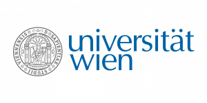

#Über [learn2proGrAME](https://programe.at)

##Das Projekt

 

**Unter welchen Bedingungen kann Computerspieleentwicklung das Programmierenlernen verbessern?**
 
Der Grundgedanke des Projekts lautet: Schülerinnen und Schüler erforschen das eigene Programmierenlernen im Zuge der Entwicklung von Computerspielen und können so über Prozesse Erkenntnisse gewinnen, die den Forschenden, die bereits programmieren können, nicht mehr genuin zugänglich sind (bzw. jenen Forschenden, die nicht planen programmieren zu lernen, überhaupt nicht zugänglich sind).

Im Zuge des Lernprozesses nehmen die Schülerinnen und Schüler nicht nur die herkömmliche Rolle von Lernenden ein, sondern reflektieren ihr Lernen aktiv im Austausch mit den anderen Beteiligten und leisten damit einen Beitrag zur Generierung von neuem Wissen.

Programmieren lernen ist für die meisten Menschen eine große Herausforderung und nicht selten mit zahlreichen Schwierigkeiten verbunden. Das gilt auch für fünfzehnjährige Schülerinnen und Schüler. Im Projekt proGrAME soll das Programmierenlernen der Schülerinnen und Schüler der neunten Schulstufe (5. Klasse AHS) durch Computerspielentwicklung erfolgen und begleitend durch Wissenschaftlerinnen und Wissenschaftler, Schülerinnen und Schüler aus höheren Schulstufen im Rahmen der Wahlpflichtfächer Psychologie/Philosophie und Informatik und auch durch die Programmieren-Lernenden selbst, erforscht werden. In diesem Prozess entwickeln und erproben Wissenschaftlerinnen und Wissenschaftler gemeinsam mit den Lernenden, didaktische Szenarien mit Spieleentwicklungsumgebungen und identifizieren signifikante Erfahrungen sowie Probleme beim Programmieren lernen und erarbeiten gemeinsam nachhaltige Lösungen.“

 
 
##Das Team

##Für Lehrpersonen: Lernergebnis Strukturmodell

**Voraussetzungen: [DigiKomp(DK) 31., 3.3](https://digikomp.at/index.php?id=585&L=0)** 

**Inhalte[^1]:**

* Objekt-orientierte Programmierung
    * Datenstrukturen
        * Variablen
        * Datentypen
        * Operatoren
    * Kontrollstrukturen
        * Verzweigungen
        * Schleifen
        * Bereiche und Zugriffskontrolle
    * Objekte
        * Funktionen
        * Klassen (Erzeugung, Kapselung, Vererbung)
    * Automatentheorie
        * Objekt-Zustände

* Präsentation
    * Programmierstil
        * Bedeutungsvolle Bezeichnungen
        * Programmierkonventionen

* Kognitive Prozesse
    * Problemlösungsorientierung
        * Verwendung von Algorithmen
        * Testen
        * De-Buggen
	* Lesen (Interpretation von Programmfunktionalität)
    * Implementierung (Entwicklung von ausführbaren Programmen)

* Meta-Kognitive Prozesse
    * Teamarbeit
        * Gemeinsam Probleme lösen
        * Gemeinsam Ideen umsetzen
        * Arbeitsteilung
    * Selbstbestimmung
        * Weiterführende Entwicklung von Anwendungen
        * Verwendung von Dokumentation
    * Kreativität
        * Originalität
		

**Ergebnisse: [DK 1.4, 4.1, 4.2, 4.3, 4.4](https://digikomp.at/index.php?id=585&L=0)**

[^1]: Siehe auch: Kramer, M., Hubwieser, P., & Brinda, T. (2016). A competency structure model of object-oriented programming. In Learning and Teaching in Computing and Engineering (LaTICE), 2016 International Conference on (pp. 1-8). IEEE.

