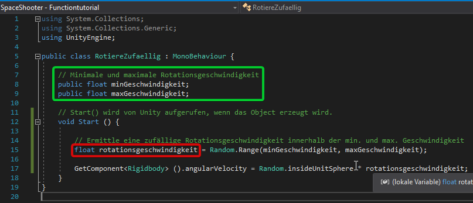
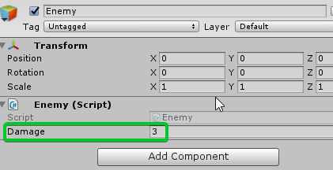

#Zugriffsmodifikatoren (access modifiers)

!!! Abstract "Lernziele"
    In diesem Kapitel lernst du, was Zugriffsmodifikatoren von [Variablen](variables.md) und [Funktionen (Methoden)](functions.md) sind und wann du welche Art verwenden solltest.
---

##Klassenvariablen

**Klassenvariablen** sind [Variablen](variables.md), die in einer Klasse außerhalb von [Funktionen](functions.md) deklariert werden.  

Hier sind `minGeschwindigkeit` und `maxGeschwindigkeit` **Klassenvariablen**.  
`rotationsgeschwindigkeit` ist keine Klassenvariable, da sie in der Funktion `Start()` deklariert wurde. Sie ist eine **lokale Variable**, die nur innerhalb der Methode verfügbar ist.

##Was sind Zugriffsmodifikatoren?

Zugriffsmodifikatoren legen fest von wo aus man auf eine **Klassenvariable** oder eine [Funktion](functions.md) zugreifen kann.  
Die drei wichtigsten Zugriffsmodifikatoren sind:

* **public** - Zugriff von überall
* **private** - Zugriff nur innerhalb der Klasse
* **protected** - Zugriff innerhalb der Klasse und von allen Klassen die von dieser Klasse erben. (Mehr zu Vererbung unter [Objektorientierte Programmierung](classes.md))

!!!Tip "Tipp"
    *public* Variablen können in Unity auch im Inspector eingesehen und verändert werden.
---

Zum Beispiel:
```csharp
public class Player {
	private int hitpoints = 10;
	
	public void NimmSchaden(int schaden){
		hitpoints = hitpoints - schaden;
	}
}
```

```csharp
public class Enemy {
	public int damage;
	
	private void Attack(Player player){
		player.NimmSchaden(damage);
	}
}
```

`hitpoints` aus der Klasse `Player` ist *private* und kann somit aus der Klasse `Enemy` nicht direkt verändert werde.  
Die Methode `NimmSchaden()` ist aber *public*. Somit kann man aus der Klasse `Enemy` mithilfe dieser Methode die Hitpoints eines Player Objekts verändern.

`damage` in `Enemy` ist *public*. Das heißt in Unity scheint diese Variable im Inspector auf und du kannst direkt im Inspector den Schaden eines Gegners einstellen.


Außerdem kann man auch sonst von überall auf `damage` zugreifen. Du könntest z.B. `Player` folgendermaßen erweitern:
```csharp

public class Player {
	private int hitpoints = 10;
	
	public void NimmSchaden(int schaden){
		hitpoints = hitpoints - schaden;
	}
	
	private void MacheGegnerHarmlos(Enemy enemy){
		enemy.damage = 0;
	}
}
``` 

!!!Bug "Achtung"
	Wenn man für Klassenvariablen oder Methoden keine Zugriffsmodifikatoren angibt, werden diese implizit auf *private* gesetzt.
---


!!!Tip "Faustregel"
	Zugriffsmodifikatoren sollten, wenn möglich immer möglichst restriktiv verwendet werden.  
	Das heißt *public* sollte man nur dann verwenden, wenn man einen guten Grund dafür hat.

	Ein Programm wird nämlich sehr schnell sehr unübersichtlich, wenn Variablen von vielen verschiedenen Stellen aus bearbeitet werden.  
	Dadurch kommt es leichter zu Bugs. Außerdem sind diese Bugs dann auch schwerer zu finden.
---

##Weiterführende Resourcen

* [Scope and Access Control in Unity Tutorial  (englisch)](https://unity3d.com/learn/tutorials/topics/scripting/scope-and-access-modifiers)