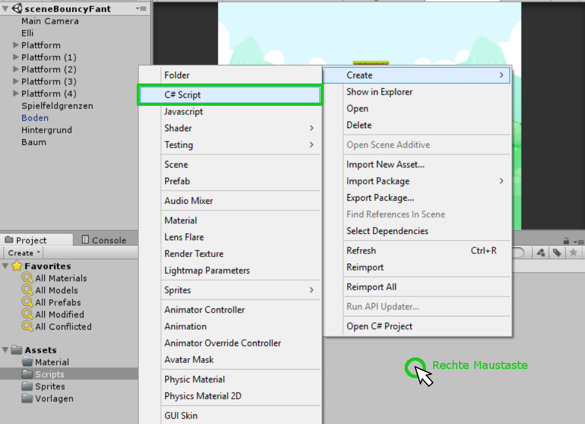
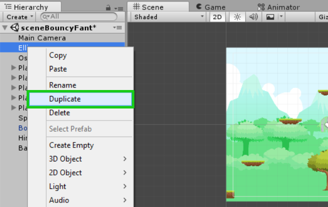
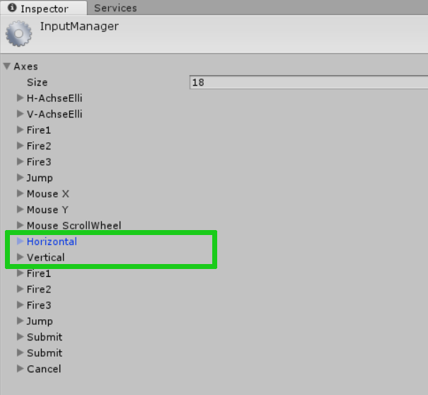
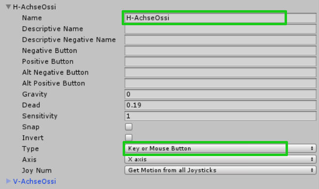
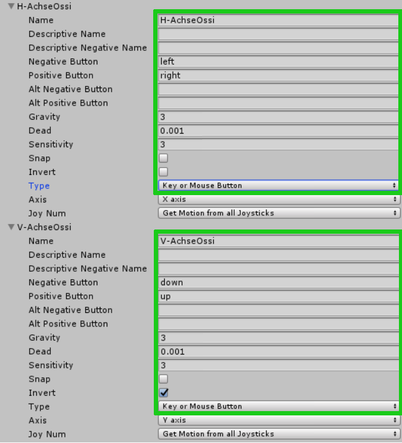

# Teil 5 - Zweite Spielfigur erstellen

!!! Abstract "Lernziele"
	In diesem Kapitel lernst du wie man eine zweite Spielfigur erstellt. Du lernst über das Konzept von Vererbung in der Programmierung und wie Mutter-und Kindklassen schreibst, um Zeit zu sparen.

In diesem Kapitel wirst du...  |
-------------------------------|
Die Steuerung deiner Figur einstellen. |
Über Vererbung in der objektorientierten Programmierung lernen. |
Ein neues BouncyFant.cs Script erstellen.  |
Die Codeteile die alle Spielfiguren gemeinsam haben zu BouncyFant.cs verschieben. |
Zwei neue Skripte für deine Spielfiguren Elli und Ossi erstellen, die von dem neuen BouncyFant.cs erben. |
Die Variablennamen in Elli.cs und Ossi.cs gegebenfalls anpassen. |
Die Input Manager Einstellungen für deine zweite Spielfigur tätigen. |


### Objektorientierte Programmierung, Vererbung
In diesem Kapitel erstellen wir eine zweite Spielfigur. Wir möchten jedoch nicht einfach eine Kopie der vorhandenen Spielfigur erstellen, sondern wir möchten eine Parent-Klasse erstellen von der wir dann die Child-Klassen ableiten.


Dazu ist es hilfreich über die grundlegenden Prinzipien der objektorientierten Programmierung Bescheid zu wissen. Wer sich noch einmal die Grundlagen der objektorientierten Programmierung durchlesen möchte, kann diese in unserem Moodle-Kurs unter diesem Link finden: Lernmaterialien über objektorientierte Programmierung

#### Einführende Übung
Überlegt in Gruppen zu je vier Personen, welche Vorteile eine Vorlage einer Spielfigur, von der dann die weiteren Spielfiguren abgeleitet sind, bringt. Notiert eure Ergebnisse auf einem Medium (Papier, PC, Smartphone) eurer Wahl.

##### Mögliche Vorteile (Beispielantworten)
 * Der Quellcode wird strukturierter und übersichtlicher.
 * Man kann durch Vererbung gemeinsame Eigenschaften und gemeinsames Verhalten teilen Muss den Quellcode nicht doppelt implementieren/kopieren.
 * Änderungen in der Vorlage wirken sich automatisch auf die abgeleiteten Objekte aus. Man muss nicht jede Änderung für jede Spielfigur durchführen.

### Ein neues Objekt “BouncyFant” erstellen
Das neue Objekt, dass wir benötigen, realisieren wir einfach in einem Script. Dazu erstellen wir in unserem Script-Verzeichnis das Script BouncyFant.cs.




Die Methoden Start und Update können wir löschen, da wir sie in der übergeordneten Klasse nicht benötigen.
Nun verschieben (Ausschneiden - STRG + X ) wir von Elli alle Variablen und Methoden, die allen Elefanten gemeinsam sein sollen, in die Klasse BouncyFant. Am Ende soll unsere Klasse BouncyFant nun so aussehen:

``` c#
using System.Collections;
using System.Collections.Generic;
using UnityEngine;

public class BouncyFant : MonoBehaviour {
    protected Rigidbody2D Elefantenkoerper;
    protected Animator Animation;
    public float MaxGeschwindigkeit = 10;
    public string Name;

    // Prozedur zum Bewegen des Elefanten
    protected void Gehen(float h)
    {
        /* Geschwindigkeit setzen
            * Die Geschwindigkeit ergibt sich aus aus der Eingabe für die horizontale
            * Geschwindigkeit und der maximalen Höchstgeschwindigkeit des Elefanten
            */
        Elefantenkoerper.velocity = new Vector2(h * MaxGeschwindigkeit, Elefantenkoerper.velocity.y);

        /* Blickrichtung des Elefanten bestimmen.
            * Der Vektor für die Blickrichtung soll ein Vektor sein,
            * der sich aus dem Vorzeichenrückgabewert (-1 oder +1)
            * der horizontalen Bewegungsrichtung (Mathf.Sign(h)) ergibt.
            * Der y-Wert des Elefanten bleibt gleich, daher transform.localScale.y.       
            */
        if (h != 0) transform.localScale = new Vector2(Mathf.Sign(h), transform.localScale.y);

        /* Die Geschwindigkeit wird auf den Absolutbetrag der horizontalen
            * Bewegung gesetzt. Negative Geschwindigkeit gibt es nicht.
            * z.B. wenn ich mit dem Auto im Rückwärtsgang 10km/h fahre, fahre ich
            * 10km/h in einer Rückwärtsbewegung und nicht "-10km/h" ;)
            */
        Animation.SetFloat("Geschwindigkeit", Mathf.Abs(h));
    }
}
```


Damit Elli die Methoden und Variablen der Parent-Klasse BouncyFant  auch nutzen kann, teilen wir dem Compiler mit, dass Elli eine Child-Klasse von BouncyFant ist.Dies bewerkstelligen wir, indem wir die oberste Zeile der Klasse Elli ändern.
``` public class Elli : BouncyFant { ```

Die Klasse Elli sieht nun so aus:

``` c#
using System.Collections;
using System.Collections.Generic;
using UnityEngine;

public class Elli : BouncyFant {
    // Anfangseinstellungen setzen
    void Start ()
    {
        // Den Namen setzen
        Name = "Elli";

        // Elefant mit RigidBody verlinken
        Elefantenkoerper = GetComponent<Rigidbody2D>();

        // Eine Referenz auf den Animator hinzufügen
        Animation = GetComponent<Animator>();
    }

    // Fixed Update wird immer in einem fixen Intervall aufgerufen.
    void FixedUpdate()
    {
        Gehen(Input.GetAxis("H-AchseElli"));
    }
}
```
In  der Prozedur Start, fügen wir unter der Zeile ```Animation = GetComponent<Animator>();``` noch den Quellcode ein, um die Farbe von Elli auf einen leichten rötlichen Ton zu ändern.
``` c#

// Setzen von Ellis Farbe auf einen leichten Rotton - Color(Rot, Grün, Blau)
GetComponent<SpriteRenderer>().color = new Color(0.96f, 0.85f, 0.8f);
```
Jetzt können wir  uns bereits um Ellis Begleiter kümmern. Zuallererst klicken wir in der Hierarchy mit der rechten Maustaste auf Elli und duplizieren das GameObject Elli.



Das neue GameObject benennen wir nun um, beispielsweise in "Ossi".

Der Elefant Ossi benötigt ein eigenes Script. Durch das Duplizieren des Objekts Elli ist auch noch Elli Script in Ossi enthalten. Dieses Script löschen wir im Inspector.


Ossis neues Script erstellen wir via Add Component->New Script ebenfalls im Inspector. Doch einen Doppelklick auf das Script öffnet sich wieder Visual Studio.  Wann legen wir zuerst fest, dass Ossi  von der Klasse BouncyFant abgeleitet wird:
```public class Ossi : BouncyFant {```

!!!Bug "Wichtig"
	Vergiss nicht, den Namen der Klasse auch auf Ossi umzuändern. Außerdem müssen in C# der Dateiname und der Name der Klasse übereinstimmen, sonst gibt es Fehlermeldungen. Die Datei der Klasse Ossi muss also Ossi.cs heißen.

Die anderen Quellcodeteile können wir aus Elli.cs kopieren. Dabei ändern wir nur die Zeile mit der Farbe und die Zeile mit der Eingabeachse, sodass unser Quellcode schließlich so aussieht.
``` c#
using System.Collections;
using System.Collections.Generic;
using UnityEngine;

public class Ossi : BouncyFant {
    // Anfangseinstellungen setzen
    void Start()
    {
        // Den Namen setzen
        Name = "Ossi";

        // Elefant mit RigidBody verlinken
        Elefantenkoerper = GetComponent<Rigidbody2D>();

        // Eine Referenz auf den Animator hinzufügen
        Animation = GetComponent<Animator>();

        // Setzen von Ossis Farbe auf einen leichten Blauton - Color(Rot, Grün, Blau)
        GetComponent<SpriteRenderer>().color = new Color(0.76f, 0.86f, 0.98f);
    }

    // Fixed Update wird immer in einem fixen Intervall aufgerufen.
    void FixedUpdate()
    {
        Gehen(Input.GetAxis("H-AchseOssi"));
    }
}
```

Gerne könnt ihr probieren, wie das Spiel läuft, wenn ihr die Eingabe Achse nicht ändert. Dann steuern sich die Elefanten wunderbar synchron - beide mit den Tasten A und D.

Jetzt wo wir schon die Eingabe Achse geändert haben sollten wir auch gleich in den Projekteigenschaften die veränderte Achse definieren. Das bewerkstelligen wir wieder in den Input Settings.

 

In den Input Settings (im Inspector) finden wir zwei weitere Achsen, die Horizontal und Vertical heißen.





Diese Achsen benennen wir in H-AchseOssi und V-AchseOssi um und ändern folgende Einstellungen:

 * H-AchseOssi
	* Negative Button: left
	* Positiv Button: right
	* Type: Key or Mouse Button
 * V-AchseOssi
	* Negative Button: down
	* Positiv Button: up
	* Type: Key or Mouse Button




Das war's auch schon. Jetzt sind beide Elefanten unabhängig voneinander steuerbar, Elli mit den Tasten A und D und Ossi mit den Pfeiltasten.

---

##### Sourcecode
[Download Sourcecode Teil 05](https://github.com/learn2proGrAME/proGrAME-Beispiele-und-Quellcodes/blob/master/BouncyFant/T05/Bouncy%20Fant%2005.zip)
