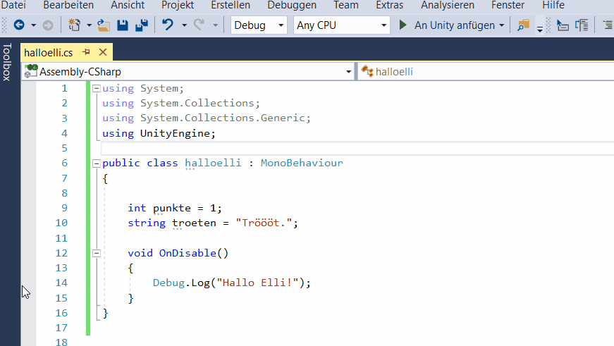
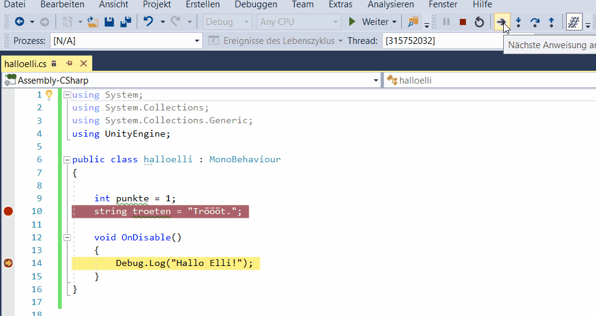

#Fehler und De-Bugging

!!! Abstract "Lernziele"
    Hier lernst du, wie du etwas in Unity "rückgängig machen" kannst. Außerdem lernst du den Begriff "De-Bugging" kennen. Du lernst, wo dir in Unity Programmierfehler angezeigt werden und wie du damit umgehen kannst.

----
Das Schöne am Programmieren ist: Fehler machen gehört dazu!

Fehler sind super Lernmöglichkeiten!

[Auch Profis machen Fehler.](https://dzone.com/articles/why-expert-developers-still-make-mistakes-1)

##Es klappt nicht! Was nun?

Was kann man tun, wenn was nicht klappt? 

Wenn du dich vertippt hast oder unabsichtlich was gelöscht hast, kannst du das in Unity rückgängig machen. 

!!!tip "Tipp"
    Rückgängig machen kannst du mit der Tastenkombination: ```strg + z```

Ok... aber was, wenn du auf Start drückst, aber nichts passiert?

Schau in der Konsole nach, was da geschrieben steht.


Unity gibt in der Konsole Warnungen und Fehlermeldungen aus, sobald du das Spiel gestartet hast.

Warnungen und Fehlermeldungen beinhalten üblicherweise je eine **Fehlerbeschreibung** (auf Englisch) UND eine **Zeilenangabe**, auf welcher Zeile (und in welchem Skript) der Fehler aufgetreten ist. 


##De-Bugging in Unity?

Hast du eine **Fehlerbeschreibung**, aber verstehst noch nicht, was da steht?

* Lese im Grundlagentutorial nach, ob da was zu deinem Fehler steht (Es gibt auch eine Suchfunktion!)

* Frag eineN KollegIn

* Wenn es ein Hilfeforum gibt: Schreib deinen Fehler in das Forum

* Frag eineN erfahreneN LernerIn (etwa eineN TutorIn oder eine Lehrperson)

* Im Internet gibt es auch Hilfeforen: etwa das [Unity Forum](https://forum.unity.com) oder [StackOverflow](https://stackoverflow.com/questions/tagged/unity3d)

**De-Bugging** bedeutet, dass du Computer-Programm-Fehler (Bugs) ausbesserst. 

[Hier ist ein Bild vom ersten echten "Bug", der jemals in einem Computerprogramm gefunden wurde! ;)](https://www.wired.com/wp-content/uploads/blogs/geekdad/wp-content/uploads/2009/09/computerbug.jpg)

##De-Bugging in Visual Studio

Hast du eine **Fehlerbeschreibung** und eine **Zeilenangabe**, kannst du die Zeile in deinem C*#* Skript in Visual Studio suchen. 

* Vielleicht hast du nur einen ```;```(Strichpunkt) vergessen? 

* Oder Groß- und Kleinschreibung bei Bezeichnungen nicht eingehalten?


!!!success "Arbeitsauftrag"
    Füge folgenden Programm-Teil in deinem halloelli.cs Skript nach 
	
	```void OnDisable()
    {
        Debug.Log ("Hallo Elli!");
    }```  ein:
	
	
	```
	void OnEnable()
	{
		Debug.Log("Elli ist wieder sichtbar!")
	}
	```
	
	Finde den Fehler und verbessere den Quellcode.

###Breakpoints

Um zu sehen, was sich in deinem Skript abspielt, wenn du in Unity auf Start drückst, können **Breakpoints (Haltepunkte)** gesetzt werden. Hierfür klickst du in Visual Studio links neben die Zeilennummer, wo du einen Haltepunkt setzen willst. 



Anschließend kannst du dein Spiel in Unity starten. Sobald die Ausführung deines Programms an die Stelle kommt, wo dein Haltepunkt gesetzt ist, bleibt es stehen.

Nun kannst du die Inhalte von Variablen im aktuellen Zustand beim Haltepunkt einsehen, indem du den Mauszeiger auf die Variable legst. 

Mit der Taste "Nächste Anweisung anzeigen" kannst das Programm nach einem Haltepunkt weiterlaufen lassen.





##Weiterführende Resourcen

* [Unity Forum](https://forum.unity.com)

* [Unity User Manual](https://docs.unity3d.com/Manual/index.html)

* [StackOverflow](https://stackoverflow.com/questions/tagged/unity3d)

* [Tutorial für Fortgeschrittene zum De-Buggen in Visual Studio (englisch)](https://docs.microsoft.com/en-us/visualstudio/debugger/getting-started-with-the-debugger?view=vs-2017)