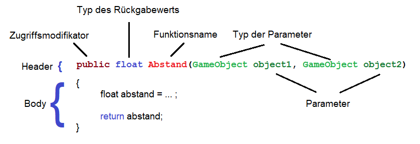

#Funktionen

!!! Abstract "Lernziele"

    In diesem Kapitel lernst du was Funktionen beim Programmieren sind. Du lernst, wofür Funktionen verwendet werden, was **Parameter** und **Rückgabewerte** sind und wie du deine eigenen Funktionen schreiben kannst.
-----

<!--!!! Abstract "Hinweis"
    In der Objektorientierten Programmierung wird statt Funktion auch oft der Begriff Methode verwendet.-->
<!-- ----- -->

##Wofür braucht man Funktionen?

Funktionen (bzw. Methoden) sind kleine *Unterprogramme*.


Vielleicht musst du für dein Spiel den Abstand zwischen zwei Objekten berechnen? Diese Berechnung benötigt man in den meisten Spielen sehr häufig.

Eine Möglichkeit ist: den dafür nötigen Code jedes Mal eintippen, oder: mit Kopieren und Einfügen überall einzufügen, wo du ihn benötigst. 
Das wäre aber nicht nur sehr viel Arbeit, sondern auch sehr schwer zu warten. Wenn du zum Beispiel später merkst, dass deine Berechnung einen Fehler enthält, musst du an allen Stellen im Programm den Fehler ausbessern.

Eine bessere Möglichkeit ist: 

Du erstellst eine **Funktion**, die den Abstand zwischen zwei Punkten berechnet.

```csharp
   //Diese Funktion berechnet den Abstand zwischen zwei Objekten
   public float Abstand(GameObject object1, GameObject object2)
    {
        float abstand = Vector3.Distance(object1.transform.position, object2.transform.position);

        return abstand;
    }
```
Anstatt nun jedes Mal diese Berechnung *händisch* durchzuführen, kannst du diese Funktion aufrufen.

```csharp
  float entfernung = Abstand(elli, ossi);
```

Außerdem musst du Änderungen nur an einer Stelle, nämlich im Code der Funktion, durchführen.

##Aufbau einer Funktion

 

Der **Zugriffsmodifikator** legt fest, von welchen Klassen man auf die Funktion zugreifen kann.

Eine Funktion kann beliebig viele **Parameter** haben. **Parameter** legen genauer fest, was die Funktion tun soll. In unserem Beispiel wird über die **Parameter** festgelegt, von welchen zwei Spielobjekten der Abstand berechnet werden soll.  
Die **Parameter** stehen im Body der Funktion als [Variablen](variables.md) zur Verfügung.

##Funktionen mit Rückgabewert

Das Schlüsselwort ```return``` beendet die Ausführung einer Funktion und gibt den danachstehenden Wert an den Methodenaufrufer zurück. 

Zum Beispiel kannst du das Ergebnis eines Aufrufs der Funktion ```Abstand()``` in einer [Variable](variables.md) speichern, oder direkt in einem *if*-Statement verwenden:

```csharp
	if(Abstand(elli, pilz) < 100){
		
	}
```


##Funktionen ohne Rückgabewert

Nicht immer benötigt man eine Funktion mit Rückgabewert.  
Für so ein Funktion gibt man als Rückgabetyp ```void``` an, außerdem benötigt man das Schlüsselwort ```return``` nicht.

Ein Beispiel aus dem Bouncyfant-Game:
```csharp
	// Springen
    protected void Springen(KeyCode Taste)
    {
        // Herausfinden, ob der Elefant irgendwo steht, von wo er abspringen kann
        bool springenmoeglich = amBoden();

        /* Wenn der Pfeil nach oben gedrückt wird und Springen möglich, 
         * d.h. der Elefant hat etwas, von wo er aus wegspringen kann,
         * dann bekommt der Elefantenkörper einen Impuls (Addforce), 
         * entsprechend der von uns gewählten Sprungkraft 
         */
        if (Input.GetKey(Taste) && springenmoeglich)
            Elefantenkoerper.AddForce(Vector2.up * Sprungkraft);

        /*
         * Wenn der Elefant gerade springt, dann springen auf nicht möglich setzen.
         * Nicht = Rufzeichen(!). 
         */
        Animation.SetBool("Springen", !springenmoeglich);
    }
``` 


!!!bug "ACHTUNG"
    Je nach Programmiersprache gibt es unterschiedliche Definitionen der Begriffe *Funktion*, *Prozedur* und *Methode*.
    Oft werden als Funktionen nur jene Methoden mit Rückgabewert bezeichnet (In Anlehnung an den Funktionsbegriff aus der Mathematik). Jene ohne Rückgabewert heißen dann *Prozedur*.
    Im Kontext von C,C++ und C# werden jedoch meist sowohl Methoden mit als auch ohne Rückgabewert als Funktionen bezeichnet.
-----

##Weiterführende Resourcen

* [Variables and Functions Tutorial (englisch)](https://unity3d.com/learn/tutorials/topics/scripting/variables-and-functions)
