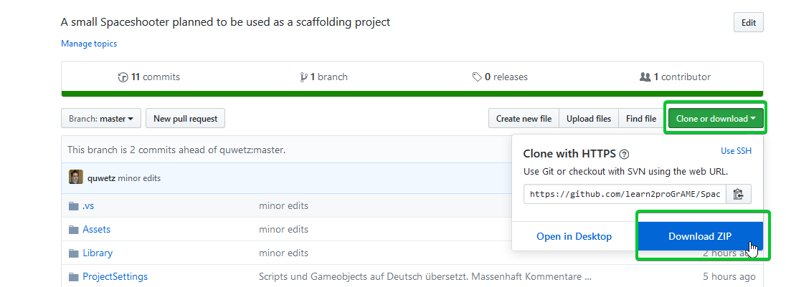
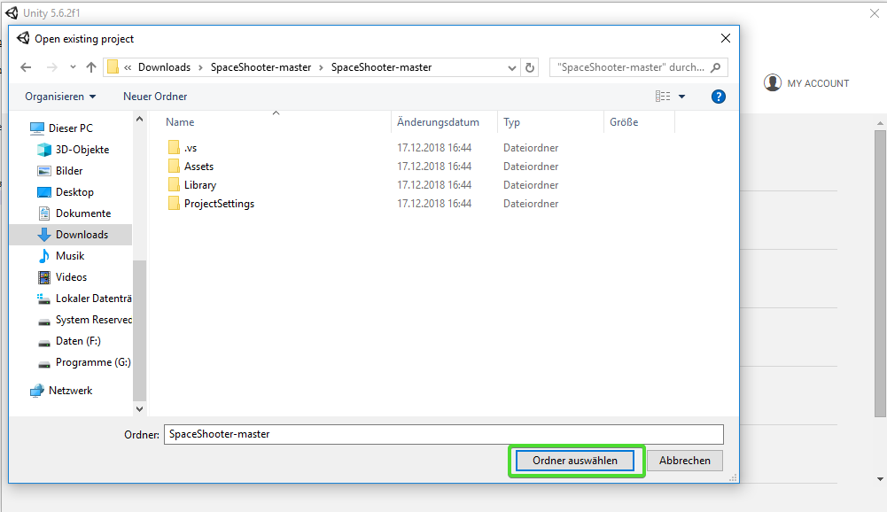

# Asteroidshooter das Spiel

!!!abstract "Lernziele"
	In diesem Kapitel wirst du mithilfe des Gelernten aus den vorigen Kapiteln die letzten Teile des Spiels Asteroidshooter selber programmieren.
	
In Asteroidshooter fliegst du mit einem Raumschiff durch ein Asteroidenfeld. Du musst die Asteroiden abschießen oder ihnen ausweichen. Wenn du von einem getroffen wirst, explodiert dein Raumschiff.

Das Spiel ist beinahe schon fertig. Lediglich die Programmierung der Asteroiden fehlt noch.
---

## 1. Projekt downloaden

1. Gehe auf [https://github.com/learn2proGrAME/SpaceShooter](https://github.com/learn2proGrAME/SpaceShooter)

2. Klicke zuerst auf **"Clone or Download"** und dann auf **"Download ZIP"**

	

3. Nach dem Download entzippe das heruntergeladene Verzeichnis, öffne **Unity** und klicke auf **"Open"**

	 

4. Gehe in das entpackte Verzeichnis und öffne das Projekt.

	

## 2. Teste das Spiel

Klicke auf den Play-Button in Unity und teste das Spiel


Du kannst mit den Pfeiltasten herumfliegen und mit der Leertaste schießen.  
Ansonsten ist das Spiel aber noch recht langweilig.


Wenn du während das Spiel läuft in die Scene-View schaust, siehst du dass schon Asteroiden am oberen Spielfeldrand erzeugt werden.  
Allerdings tun diese noch nichts.

----

## 3. Die Bewegung

### 3.1. Die benötigten Variablen deklarieren

Als erstes kümmern wir uns darum, dass die Asteroiden in Bewegung gesetzt werden. Sie sollen senkrecht vom oberen Rand des Spielfelds zum unteren Rand fliegen.

Öffne unter *Assets/Scripts* das Script **Asteroid**  

Da wir die eingebaute Physic-Engine von Unity verwenden, benötigen wir für die Bewegung einen Rigidbody.

Erstelle als erstes eine *private* Variable vom Typ *Rigidbody* in der dieser gespeichert wird.

```csharp
	private Rigidbody rb;
```

Lege außerdem noch eine *public* Variable für die Geschwindigkeit an mit der der Asteroid fliegen soll.

```csharp
	public float geschwindigkeit;
```

### 3.2. Bewegung!

Bevor du den Asteroiden in Bewegung setzen kannst, musst du die Variable des Rigidbodys initialisieren.  

Mache dies in der `start()` Methode mit dem Befehl `GetComponent<Rigidbody>()`

Dein Code sollte so aussehen:

```csharp
	 //Start() wird von Unity aufgerufen, wenn das Object erzeugt wird.
    void Start(){
        //Setze die Referenz auf den Rigidbody
        rb = GetComponent<Rigidbody> ();
	}
```

Nun müssen wir dem Rigidbody nur noch eine Geschwindigkeit geben.  
Verwende hierfür den Befehl `rb.velocity = new Vector3 (0, 0, -geschwindigkeit);`

Füge diesen Befehl ebenfalls in der `Start()` Methode nach dem Initialisieren von `rb` ein.

Vielleicht ist dir aufgefallen, dass wir die Variable geschwindigkeit noch gar nicht initialisiert haben. Das ist kein Problem. Da diese *public* ist, kann man ihren Wert im Inspector von Unity festlegen.

Speichere das Script und gehe wieder in Unity.

Im Ordner *Assets/Prefabs* findest du die Vorlage für die Asteroiden. Wenn du sie auswählst siehst du, dass das Script *Asteroid.cs* bereits angehängt ist. Wenn du nun noch die geschwindigkeit auf einen Wert größer als 0 setzt, bist du mit diesem Teil fertig.

[geschwindigkeitSetzen](img/asteroid1.png)

Vergiss nicht zu testen und probiere ein paar unterschiedliche Werte für die Geschwindigkeit aus!

----

## 4. Rotation

Die Asteroiden bewegen sich nun zwar, allerdings sehen sie noch ein bisschen leblos aus. Lassen wir sie rotieren!

Sie sollen mit einer bestimmten Geschwindigkeit um eine zufällige Achse rotieren.

Erstelle eine *public* Variable vom Typ *float* für die Rotationsgeschwindigkeit und gib ihr einen sinnvollen Namen.

Dann füge am Ende der Methode `start()` folgenden Befehl ein:

```csharp
	rb.angularVelocity = Random.insideUnitSphere * rotationsgeschwindigkeit;
```

Wobei `rotationsGeschwindigkeit` der von dir gewählte Variablenname sein muss. 

Speichere das Skript, gehe in Unity und setze die Rotationsgeschwindigkeit im Inspector so wie in Schritt 3.2.

Teste!