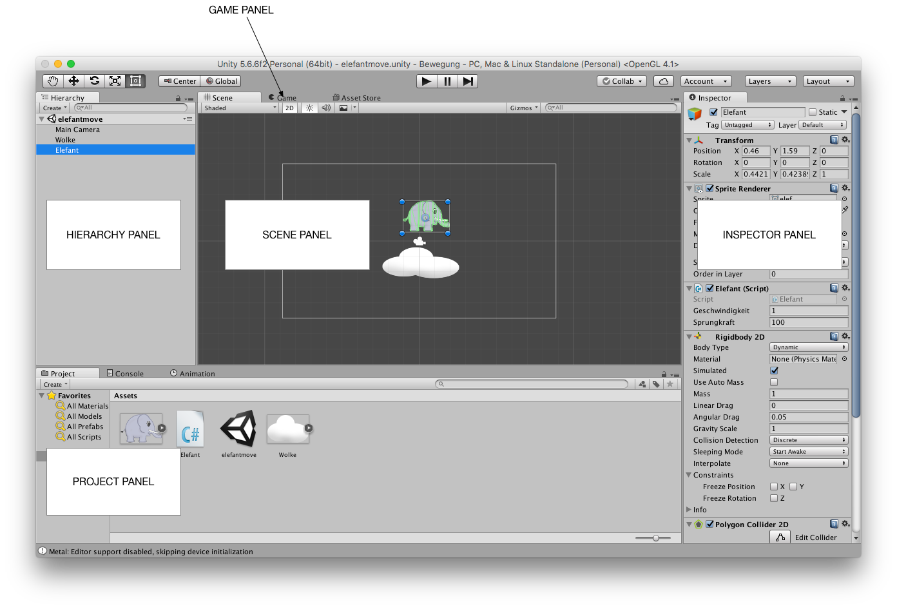
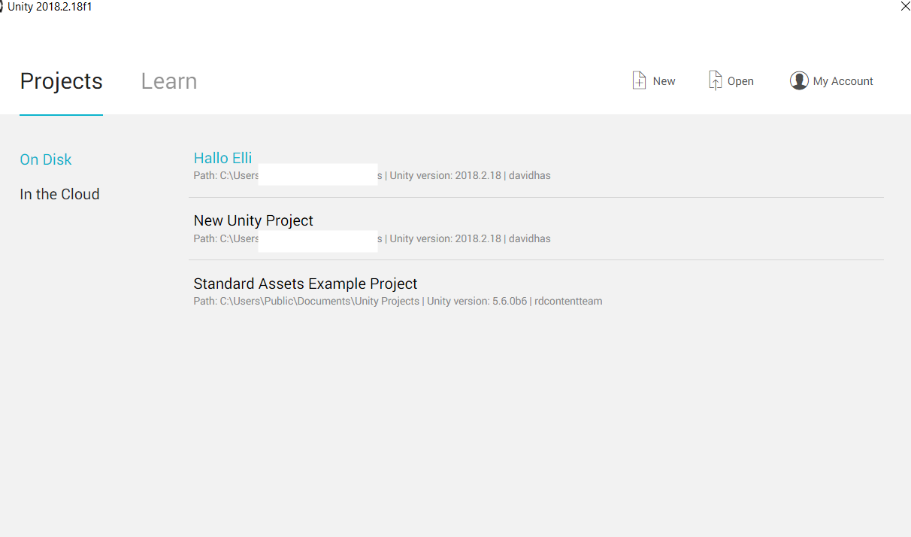
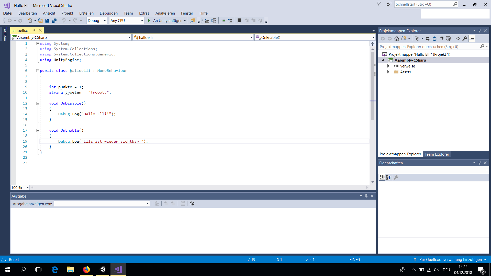

#Bedienoberflächen

!!! Abstract "Lernziele"
	Für die Spieleprogrammierung wirst du vorwiegend zwei Anwendungsprogramme verwenden:

	* [Unity](https://unity3d.com) zur Entwicklung von Spielszenen und 
	* [Visual Studio](https://visualstudio.microsoft.com/vs/community/) zum Schreiben von Programm-Scripts.
	
	In diesem Kapitel lernst du die Bedienoberflächen von Unity und Visual Studio kennen. Du lernst auch, worauf du beim Anlegen eines neuen Projekts und beim Speichern in Unity achten musst. 


---

##Unity Bedienoberfläche

Als Analogie für das Erschaffen eines Spiels kannst du dir vorstellen, einen Film zu machen. Unity besteht aus Menüs und Panels (=Bedienfelder), die verschiedene Aspekte des Spiel-projekts umfassen. 
Wie im Film bestehen in Unity Spiele aus einer oder mehrerer **Szene(n)**. 

* Im **Hierarchy Panel** findest du alle GameObjects - Requisiten -, die du in der Szene, an der du gerade arbeitest, verwendest. Diese sind hierarchisch - nach Zugehörigkeit und nach der Reihe - geordnet. Die Reihenfolge kannst du per Drag and Drop verändern. 

* Im **Inspector Panel** kannst du Eigenschaften eines GameObjects verändern, sowie Komponenten an ein GameObject "anheften".

* Die Szene, an der du momentan arbeitest, wird im **Scene Panel** angezeigt. Hier kannst du Requisiten aus dem Hierarchie-Panel in der Szene anordnen. 

* Das **Game Panel** zeigt deine aktuelle Szene aus der Kameraperspektive. In diesem Panel kannst du dein Spiel testen, sobald du es startest.

* Wie es beim Filme-machen ein Requisiten-Lager gibt, so bietet Unity das **Project Panel**. Hier sind alle **Assets** - alle "Güter" oder Resourcen - deines Spiel-projekts auffindbar. Das Projekt-Panel ist als Dateisystem organisiert. Hier sammelst du alle Grafiken für dein Spiel, sowie alle Soundeffekte, Spielobjekt-Prototypen oder Szenenaufbauten deiner Spiel-Szenen. Um mehr Übersicht zu haben, können Assets in Ordnern gespeichert werden. Assets werden als GameObjects, Komponenten oder Komponenteneigenschaften in einer Szene verwendet.



Szenen in Unity sind hierarchisch - in Ebenen - organisiert. Prinzipiell werden GameObjects in der Folge angezeigt, in der sie erzeugt werden. Per Drag and Drop können diese neu angeordnet werden oder gruppiert werden.

!!!tip "Tipp"
    Sowohl das Szenen-Panel wie auch das Projekt-Panel haben eine Suchfunktion.

----

###Neues Projekt anlegen

!!!success "Arbeitsauftrag"
	Lege ein neues Projekt in Unity an. Es ist ein 2D-Spiel. Nenne es "Hallo Elli".
	

	
!!!bug "ACHTUNG"
    Merke dir, **wo** du dein Projekt am Computer anlegst.
		
	Wenn du weißt, wo dein Projekt ist, kannst du es leicht kopieren oder auf deinem USB Stick speichern.

!!!tip "TIPP"
	Du kannst auch in Unity über den Menüpunkt *"Assets"* > *"Im _Dateimanager_ anzeigen"* die Dateien deines Projekts im Dateisystem auf deinem Computer anzeigen lassen.

----

###Spiel starten (und stoppen)


!!!bug "ACHTUNG"
    Alle Änderungen, die du in Unity vornimmst, während das Spiel gestartet ist, werden NICHT übernommen, sobald du das Spiel wieder stoppst!

----

###Speichern

In Unity können Szeneneinstellungen mit "Save Scene" gespeichert werden. Projekteinstellungen werden mit "Save Project" gespeichert.


----

##Visual Studio Bedienoberfläche

Visual Studio ist eine Programmierumgebung. C*#*-Skripte können in Visual Studio geschrieben werden.



Damit geschriebener Code in Unity ausgeführt werden kann, musst du dein Skript in Visual Studio speichern.

!!!tip "Tipp"
    Eine Tastenkombination für Speichern (in Visual Studio) ist: ```strg + s```

----

##Weiterführende Resourcen

* [Unity User Interface (englisch)](https://docs.unity3d.com/Manual/LearningtheInterface.html)

* [Unity Hauptfenster (englisch)](https://docs.unity3d.com/Manual/UsingTheEditor.html)

* [Visual Studio Grundlagen](http://www.csharpme.de/entwicklungsumgebung.php)