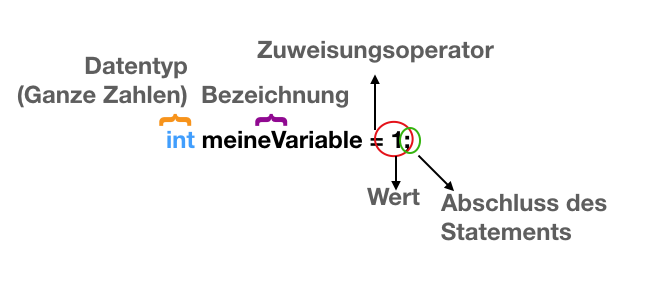
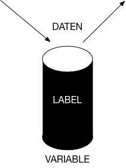

#Variablen

!!! Abstract "Lernziele"
    In diesem Kapitel lernst du was Variablen beim Programmieren sind. Du lernst, wie du eine Variable erzeugen kannst durch **Deklarieren** und **Initialisieren**. Außerdem lernst du, was **Datentypen** sind.




Das bedeutet: *Der Integer-Variable "meineVariable" wird der Wert 1 zugewiesen.* Man kann auch sagen: *Die Integer-Variable "meineVariable" wird mit dem Wert 1 initialisiert.*

-----

##Wozu Variablen?

* Mit Variablen kannst du Daten speichern und ändern.

Ein Beispiel:
``` c#
int x = 1;
int y = 2;
int z = x + y;
```

!!!success "Übung"
    Welchen Wert hat z?

* Letztlich bezeichnen Variablen einen Speicherplatz.
Man kann sich das etwa wie ein Postfach vorstellen, auf dem eine Address-Bezeichnung steht.

* Diesem Speicherplatz können Werte (also Daten) zugewiesen werden. Zuweisen kann man in C*#* mit dem Zuweisungs-Operator ```=```.

 

-----

##Deklarieren und Initialisieren

* **Deklarieren** bedeutet, dass man eine Variable benennt und ihr einen **Datentyp** zuordnet. 

Datentypen bezeichnen die Form der Daten, also was die Nullen und Einser in einer Bit-Folge jeweils bedeuten.

!!!tip "Tipp"
    Ein Bit ist die kleinste Einheit, mit der Computer rechnen. Ein Bit ist entweder 0 oder 1. Mit Bits kann man [im Binärsystem rechnen](https://www.studienkreis.de/mathematik/zweiersystem/). 

* **Initialisieren** bedeutet, dass man einer Variable das erste Mal einen Wert zuweist.

!!!success "Übung"
    Analysiere folgenden Quellcode. In welcher Zeile wird eine Variable deklariert? Wo wird eine Variable deklariert und initialisiert?
	
	
```
	int ersteVariable;
	int zweiteVariable = 2;
```
   
-----

## Datentypen

Datentypen zeigen an, welche Art von Daten einer Variable zugewiesen werden können. Sie zeigen an, wie Daten (also Folgen von Nullen und Einsen) interpretiert werden sollen.

Wichtige Datentypen sind:

| Datentyp                       | Steht für                       | Umfang                                     | Default Wert                            |
| ------------------------------ | ------------------------------- | ------------------------------------------ | --------------------------------------- |
| bool                           | Boolean (wahr oder falsch       | True/False                                 | False                                   |
| int                            | 32-bit Integer (Ganze Zahlen)   | -2147483648 bis 2147483647                 | 0                                       |
| float                          | 32-bit Float (Gleitkommazahlen) | -3,4mal10hoch38 bis 3,4mal10hoch38             | 0.0f                                    |
| double                         | 64-bit Gleitkommazahlen         | (+/-)5,0mal10hoch-324 bis (+/-)1,7mal10hoch308 | 0.0D                                    |
| string                         | Text                            | "Text"                                     | null (string ist ein Referenz-Datentyp) |
| Sonderfall: Klassenbezeichnung | Objekte einer Klasse            | Eigenschaften der Instanz einer Klasse     | null                                    |


!!!success "Arbeitsauftrag"
    Ergänze die Funktion ```OnDisable()``` im Skript halloelli.cs um zwei Variablen: ```string spiel``` und ```int preis```. Weise der Variable "spiel" den Wert ```"Elli Dance"``` zu. Weise der Variable "preis" den Wert ```5``` zu. Ergänze Debug.Log() um folgenden string: ```"Das Spiel" + spiel + "kostet" + preis + "Euro."```
	
!!!tip "Tipp"
    ```+``` ist der [Additions-Operator](operators.md). Bei Zahlen addiert dieser, strings werden durch diesen zusammengefügt.

-----

###Umwandlung von Datentypen

Datentypen können manchmal in andere Datentypen umgewandelt werden. Folgende Funktionen ermöglichen neben anderen eine Typ-Umwandlung:

```.ToInt(), .ToBool(), .ToString()```

Ein Beispiel:

``` c#
int i = 75;
string zahl = i.ToString();
```

-----

## Variablen-Bereich (Scope)

Variablen, die **außerhalb** eines Code-Blocks - gekennzeichnet durch ```{ ... }``` - deklariert (also angegeben) werden, **können im Code-Block verwendet** werden. Variablen, die **im Code-Block angegeben** werden, können **nur dort verwendet** werden.

Wird einer Variable bei der Deklarierung das Schlüsselwort ```public``` vorgesetzt, so können auch Objekte darauf zugreifen, denen das Skript nicht "angeheftet" ist. Wenn eine Variable ```private``` ist, so kann nur das GameObject, dem das Skript angeheftet ist, darauf zugreifen.  

-----

##Weiterführende Resourcen

* [Variablen schnell erklärt (Video)](https://www.youtube.com/watch?v=U14WiZ0ua_0)

* [Unity Variables and Functions Tutorial (englisch)](https://unity3d.com/learn/tutorials/topics/scripting/variables-and-functions)

* [Scope and Access Control in Unity Tutorial  (englisch)](https://unity3d.com/learn/tutorials/topics/scripting/scope-and-access-modifiers)